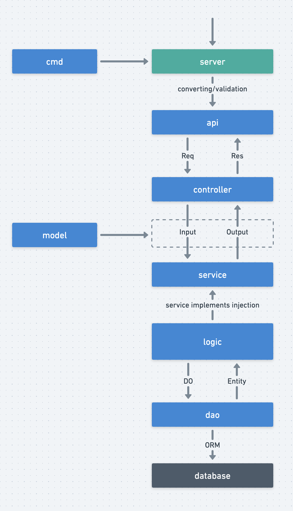

# 生命周期

## 请求分层
### cmd

cmd层负责引导程序启动，显著的工作是初始化逻辑、注册路由对象、启动server监听、阻塞运行程序直至server退出。

### api

上层server服务接收客户端请求，转换为api中定义的Req接收对象、执行请求参数到Req对象属性的类型转换、执行Req对象中绑定的基础校验并转交Req请求对象给controller层。

### controller

controller层负责接收Req请求对象后做一些业务逻辑校验，随后调用一个或多个service实现业务逻辑，将执行结构封装为约定的Res数据结构对象返回。

### model

model层中管理了所有的业务模型，service资源的Input/Output输入输出数据结构都由model层来维护

### service
service是接口层，用于解耦业务模块，service没有具体的业务逻辑实现，具体的业务实现是依靠logic层注入的。

### logic
logic层的业务逻辑需要通过调用dao来实现数据的操作，调用dao时需要传递do数据结构对象，用于传递查询条件、输入数据。dao执行完毕后通过Entity数据模型将数据结果返回给service层。

### dao
dao层通过框架的ORM抽象层组件与底层真实的数据库交互。

## 流程图

