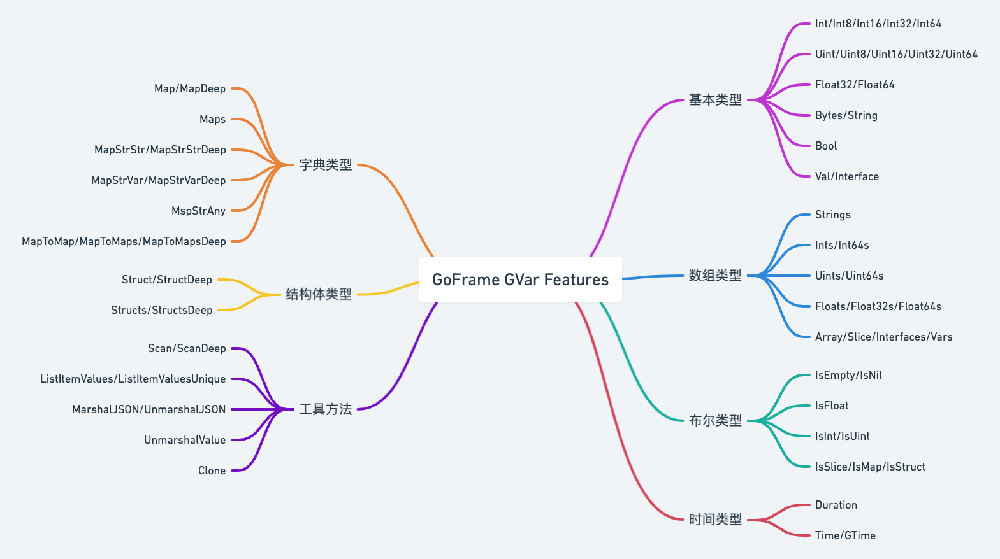

# 据结构

## 字典 gmap

### 介绍

支持并发安全开关选项的 `map`容器，最常用的数据结构。该模块包含多个数据结构的 `map`容器：`HashMap`、`TreeMap`和 `ListMap`。

| 类型        | 数据结构        | 平均复杂度   | 支持排序 | 有序遍历 | 说明                                   |
| ----------- | --------------- | ------------ | -------- | -------- | -------------------------------------- |
|             |                 |              |          |          |                                        |
| `HashMap` | 哈希表          | `O(1)`     | 否       | 否       | 高性能读写操作，内存占用较高，随机遍历 |
|             |                 |              |          |          |                                        |
| `ListMap` | 哈希表+双向链表 | `O(2)`     | 否       | 是       | 支持按照写入顺序遍历，内存占用较高     |
| `TreeMap` | 红黑树          | `O(log N)` | 是       | 是       | 内存占用紧凑，支持键名排序及有序遍历   |

此外，`gmap`模块支持多种以哈希表为基础数据结构的常见类型 `map`定义：`IntIntMap`、`IntStrMap`、`IntAnyMap`、`StrIntMap`、`StrStrMap`、`StrAnyMap`。

**并发安全:**

`gmap`支持并发安全选项开关，在默认情况下是 `非并发安全`的，开发者可以选择开启 `gmap`的并发安全特性(传递初始化开关参数 `safe`参数值为 `true`, 必须在初始化时设定，不能运行时动态设定)。如：

```
m := gmap.New(true)
```

不仅仅是 `gmap`模块，`goframe`框架的其他并发安全数据结构也支持并发安全特性开关。

 **使用场景** ：

任何 `map`/哈希表/关联数组使用场景，尤其是并发安全场景中。

 **使用方式** ：

```go
import "github.com/gogf/gf/v2/container/gmap"
```

 **接口文档** ：

[https://pkg.go.dev/github.com/gogf/gf/v2/container/gmap](https://pkg.go.dev/github.com/gogf/gf/v2/container/gmap)

### 使用

#### 基本

```go
package main

import (
    "fmt"
    "github.com/gogf/gf/v2/container/gmap"
)

func main() {
    // 创建一个默认的gmap对象，
    // 默认情况下该gmap对象不支持并发安全特性，
    // 初始化时可以给定true参数开启并发安全特性。
    m := gmap.New()

    // 设置键值对
    for i := 0; i < 10; i++ {
        m.Set(i, i)
    }
    // 查询大小
    fmt.Println(m.Size())
    // 批量设置键值对(不同的数据类型对象参数不同)
    m.Sets(map[interface{}]interface{}{
        10 : 10,
        11 : 11,
    })
    fmt.Println(m.Size())

    // 查询是否存在
    fmt.Println(m.Contains(1))

    // 查询键值
    fmt.Println(m.Get(1))

    // 删除数据项
    m.Remove(9)
    fmt.Println(m.Size())

    // 批量删除
    m.Removes([]interface{}{10, 11})
    fmt.Println(m.Size())

    // 当前键名列表(随机排序)
    fmt.Println(m.Keys())
    // 当前键值列表(随机排序)
    fmt.Println(m.Values())

    // 查询键名，当键值不存在时，写入给定的默认值
    fmt.Println(m.GetOrSet(100, 100))

    // 删除键值对，并返回对应的键值
    fmt.Println(m.Remove(100))

    // 遍历map
    m.Iterator(func(k interface{}, v interface{}) bool {
        fmt.Printf("%v:%v ", k, v)
        return true
    })

    // 自定义写锁操作
    m.LockFunc(func(m map[interface{}]interface{}) {
        m[99] = 99
    })

    // 自定义读锁操作
    m.RLockFunc(func(m map[interface{}]interface{}) {
        fmt.Println(m[99])
    })

    // 清空map
    m.Clear()

    // 判断map是否为空
    fmt.Println(m.IsEmpty())
}
```

执行后，输出结果为：

```
10
12
true
1
11
9
[0 1 2 4 6 7 3 5 8]
[3 5 8 0 1 2 4 6 7]
100
100
3:3 5:5 8:8 7:7 0:0 1:1 2:2 4:4 6:6 99
true
```

#### 有序遍历

我们来看一下三种不同类型 `map`的有序性遍历示例。

```go
package main

import (
    "fmt"
    "github.com/gogf/gf/v2/frame/g"
    "github.com/gogf/gf/v2/container/gmap"
    "github.com/gogf/gf/v2/util/gutil"
)

func main() {
    array   := g.Slice{2, 3, 1, 5, 4, 6, 8, 7, 9}
    hashMap := gmap.New(true)
    listMap := gmap.NewListMap(true)
    treeMap := gmap.NewTreeMap(gutil.ComparatorInt, true)
    for _, v := range array {
        hashMap.Set(v, v)
    }
    for _, v := range array {
        listMap.Set(v, v)
    }
    for _, v := range array {
        treeMap.Set(v, v)
    }
    fmt.Println("HashMap   Keys:", hashMap.Keys())
    fmt.Println("HashMap Values:", hashMap.Values())
    fmt.Println("ListMap   Keys:", listMap.Keys())
    fmt.Println("ListMap Values:", listMap.Values())
    fmt.Println("TreeMap   Keys:", treeMap.Keys())
    fmt.Println("TreeMap Values:", treeMap.Values())
}
```

执行后，输出结果为：

```
HashMap   Keys: [4 6 8 7 9 2 3 1 5]
HashMap Values: [6 8 4 3 1 5 7 9 2]
ListMap   Keys: [2 3 1 5 4 6 8 7 9]
ListMap Values: [2 3 1 5 4 6 8 7 9]
TreeMap   Keys: [1 2 3 4 5 6 7 8 9]
TreeMap Values: [1 2 3 4 5 6 7 8 9]
```

#### `FilterEmpty/FilterNil`空值过滤

```go
package main

import (
	"fmt"
	"github.com/gogf/gf/v2/container/gmap"
	"github.com/gogf/gf/v2/frame/g"
)

func main() {
	m1 := gmap.NewFrom(g.MapAnyAny{
		"k1": "",
		"k2": nil,
		"k3": 0,
		"k4": 1,
	})
	m2 := gmap.NewFrom(g.MapAnyAny{
		"k1": "",
		"k2": nil,
		"k3": 0,
		"k4": 1,
	})
	m1.FilterEmpty()
	m2.FilterNil()
	fmt.Println(m1.Map())
	fmt.Println(m2.Map())

	// Output:
	// map[k4:1]
	// map[k1: k3:0 k4:1]
}
```

#### `Flip`键值对反转

```go
package main

import (
	"fmt"
	"github.com/gogf/gf/v2/container/gmap"
	"github.com/gogf/gf/v2/frame/g"
)

func main() {
	var m gmap.Map
	m.Sets(g.MapAnyAny{
		"k1": "v1",
		"k2": "v2",
	})
	m.Flip()
	fmt.Println(m.Map())

	// May Output:
	// map[v1:k1 v2:k2]
}
```

#### `Keys/Values`键名/数值列表

```go
package main

import (
	"fmt"
	"github.com/gogf/gf/v2/container/gmap"
	"github.com/gogf/gf/v2/frame/g"
)

func main() {
	var m gmap.Map
	m.Sets(g.MapAnyAny{
		"k1": "v1",
		"k2": "v2",
		"k3": "v3",
		"k4": "v4",
	})
	fmt.Println(m.Keys())
	fmt.Println(m.Values())

	// May Output:
	// [k1 k2 k3 k4]
	// [v2 v3 v4 v1]
}
```

#### `Pop/Pops`随机出栈

```go
package main

import (
	"fmt"
	"github.com/gogf/gf/v2/container/gmap"
	"github.com/gogf/gf/v2/frame/g"
)

func main() {
	var m gmap.Map
	m.Sets(g.MapAnyAny{
		"k1": "v1",
		"k2": "v2",
		"k3": "v3",
		"k4": "v4",
	})
	fmt.Println(m.Pop())
	fmt.Println(m.Pops(2))
	fmt.Println(m.Size())

	// May Output:
	// k1 v1
	// map[k2:v2 k4:v4]
	// 1
}
```

#### `SetIfNotExist*`判断性写入

判断性写入是指当指定的键名不存在时则写入并且方法返回 `true`，否则忽略写入并且方法返回 `false`。相关方法如下：

* `SetIfNotExist`
* `SetIfNotExistFunc`
* `SetIfNotExistFuncLock`

方法具体描述请查看接口文档或源码注释。

```go
package main

import (
	"fmt"
	"github.com/gogf/gf/v2/container/gmap"
)

func main() {
	var m gmap.Map
	fmt.Println(m.SetIfNotExist("k1", "v1"))
	fmt.Println(m.SetIfNotExist("k1", "v1"))
	fmt.Println(m.Map())

	// Output:
	// true
	// false
	// map[k1:v1]
}
```

#### `Merge`字典表合并

```go
package main

import (
	"fmt"
	"github.com/gogf/gf/v2/container/gmap"
)

func main() {
	var m1, m2 gmap.Map
	m1.Set("key1", "val1")
	m2.Set("key2", "val2")
	m1.Merge(&m2)
	fmt.Println(m1.Map())

	// May Output:
	// map[key1:val1 key2:val2]
}
```

#### `JSON`序列化/反序列

`gmap`模块下的所有容器类型均实现了标准库 `json`数据格式的序列化/反序列化接口。

1. `Marshal`

```go
package main

import (
    "encoding/json"
    "fmt"
    "github.com/gogf/gf/v2/frame/g"

    "github.com/gogf/gf/v2/container/gmap"
)

func main() {
    m := gmap.New()
    m.Sets(g.MapAnyAny{
        "name":  "john",
        "score": 100,
    })
    b, _ := json.Marshal(m)
    fmt.Println(string(b))
}
```

执行后，输出结果：

```js
{"name":"john","score":100}
```

2.`Unmarshal`

```go
package main


import (
    "encoding/json"
    "fmt"
    "github.com/gogf/gf/v2/container/gmap"
)


func main() {
    m := gmap.Map{}
    s := []byte(`{"name":"john","score":100}`)
    json.Unmarshal(s, &m)
    fmt.Println(m.Map())
}
```

执行后，输出结果：

```
map[name:john score:100]
```

### 方法

#### `New`

* 说明：`New`创建并返回一个空的 `AnyAnyMap`。参数 `safe`用于指定是否使用并发安全的 `map`，默认情况下为 `false`。
* 格式：

  ```go
  New(safe ...bool) *Map
  ```
* 示例：

  ```go
  func ExampleNew() {
  	m := gmap.New()

  	// Add data.
  	m.Set("key1", "val1")

  	// Print size.
  	fmt.Println(m.Size())

  	addMap := make(map[interface{}]interface{})
  	addMap["key2"] = "val2"
  	addMap["key3"] = "val3"
  	addMap[1] = 1

  	fmt.Println(m.Values())

  	// Batch add data.
  	m.Sets(addMap)

  	// Gets the value of the corresponding key.
  	fmt.Println(m.Get("key3"))

  	// Get the value by key, or set it with given key-value if not exist.
  	fmt.Println(m.GetOrSet("key4", "val4"))

  	// Set key-value if the key does not exist, then return true; or else return false.
  	fmt.Println(m.SetIfNotExist("key3", "val3"))

  	// Remove key
  	m.Remove("key2")
  	fmt.Println(m.Keys())

  	// Batch remove keys.
  	m.Removes([]interface{}{"key1", 1})
  	fmt.Println(m.Keys())

  	// Contains checks whether a key exists.
  	fmt.Println(m.Contains("key3"))

  	// Flip exchanges key-value of the map, it will change key-value to value-key.
  	m.Flip()
  	fmt.Println(m.Map())

  	// Clear deletes all data of the map.
  	m.Clear()

  	fmt.Println(m.Size())

  	// May Output:
  	// 1
  	// [val1]
  	// val3
  	// val4
  	// false
  	// [key4 key1 key3 1]
  	// [key4 key3]
  	// true
  	// map[val3:key3 val4:key4]
  	// 0
  }
  ```

#### `NewFrom`

* 说明：`NewFrom`使用给定 `map`的数据创建并返回 `AnyAnyMap`。
* 注意：入参 `map`将被设置为底层数据映射（无深度拷贝），在外部更改 `map`时，可能会同时出现一些安全问题。可选参数 `safe`指定是否在并发安全中使用此结构，默认情况下为 `false`。
* 格式：

  ```go
  NewFrom(data map[interface{}]interface{}, safe ...bool) *Map
  ```
* 示例：

  ```go
  func ExampleNewFrom() {
  	m := gmap.New()

  	m.Set("key1", "val1")
  	fmt.Println(m)

  	n := gmap.NewFrom(m.MapCopy(), true)
  	fmt.Println(n)

  	// Output:
  	// {"key1":"val1"}
  	// {"key1":"val1"}
  }
  ```

#### `Iterator`

* 说明：`Iterator`使用自定义回调函数 `f`以只读方式迭代 `hashmap`。如果 `f`返回 `true`，则继续迭代，返回 `false`则停止。
* 格式：

  ```go
  Iterator(f func(k interface{}, v interface{}) bool)
  ```
* 示例：

  ```go
  func ExampleAnyAnyMap_Iterator() {
  	m := gmap.New()
  	for i := 0; i < 10; i++ {
  		m.Set(i, i*2)
  	}

  	var totalKey, totalValue int
  	m.Iterator(func(k interface{}, v interface{}) bool {
  		totalKey += k.(int)
  		totalValue += v.(int)

  		return totalKey < 10
  	})

  	fmt.Println("totalKey:", totalKey)
  	fmt.Println("totalValue:", totalValue)

  	// May Output:
  	// totalKey: 11
  	// totalValue: 22
  }
  ```

#### `Clone`

* 说明：`Clone`返回一个新的 `AnyAnyMap`，其中包含当前 `map`数据的副本。
* 格式：

  ```go
  Clone(safe ...bool) *AnyAnyMap
  ```
* 示例：

  ```go
  func ExampleAnyAnyMap_Clone() {
  	m := gmap.New()

  	m.Set("key1", "val1")
  	fmt.Println(m)

  	n := m.Clone()
  	fmt.Println(n)

  	// Output:
  	// {"key1":"val1"}
  	// {"key1":"val1"}
  }
  ```

#### `Map`

* 说明：`Map` 返回底层数据 `map`。
* 注意：如果在并发安全中，它将返回底层数据的副本，否则返回指向底层数据的指针。
* 格式：

  ```go
  Map() map[interface{}]interface{}
  ```
* 示例：

  ```go
  func ExampleAnyAnyMap_Map() {
  	// non concurrent-safety, a pointer to the underlying data
  	m1 := gmap.New()
  	m1.Set("key1", "val1")
  	fmt.Println("m1:", m1)

  	n1 := m1.Map()
  	fmt.Println("before n1:", n1)
  	m1.Set("key1", "val2")
  	fmt.Println("after n1:", n1)

  	// concurrent-safety, copy of underlying data
  	m2 := gmap.New(true)
  	m2.Set("key1", "val1")
  	fmt.Println("m1:", m2)

  	n2 := m2.Map()
  	fmt.Println("before n2:", n2)
  	m2.Set("key1", "val2")
  	fmt.Println("after n2:", n2)

  	// Output:
  	// m1: {"key1":"val1"}
  	// before n1: map[key1:val1]
  	// after n1: map[key1:val2]
  	// m1: {"key1":"val1"}
  	// before n2: map[key1:val1]
  	// after n2: map[key1:val1]
  }
  ```

#### `MapCopy`

* 说明：`MapCopy`返回 `map`的数据的副本。
* 格式：

  ```go
  MapCopy() map[interface{}]interface{}
  ```
* 示例：

  ```go
  func ExampleAnyAnyMap_MapCopy() {
  	m := gmap.New()

  	m.Set("key1", "val1")
  	m.Set("key2", "val2")
  	fmt.Println(m)

  	n := m.MapCopy()
  	fmt.Println(n)

  	// Output:
  	// {"key1":"val1","key2":"val2"}
  	// map[key1:val1 key2:val2]
  }
  ```

#### MapStrAny

* 说明：`MapStrAny`以 `map[string]interface{}`的形式返回 `map`的数据的副本。
* 格式：

  ```go
  MapStrAny() map[string]interface{}
  ```
* 示例：

  ```go
  func ExampleAnyAnyMap_MapStrAny() {
  	m := gmap.New()
  	m.Set(1001, "val1")
  	m.Set(1002, "val2")

  	n := m.MapStrAny()
  	fmt.Println(n)

  	// Output:
  	// map[1001:val1 1002:val2]
  }
  ```

#### `FilterEmpty`

* 说明：`FilterEmpty`删除值为空的所有键值对。如: `0`, `nil`, `false`, `""`, `len(slice/map/chan) == 0` 这样的值被认为是空的。
* 格式：

  ```go
  FilterEmpty()
  ```
* 示例：

  ```go
  func ExampleAnyAnyMap_FilterEmpty() {
  	m := gmap.NewFrom(g.MapAnyAny{
  		"k1": "",
  		"k2": nil,
  		"k3": 0,
  		"k4": 1,
  	})
  	m.FilterEmpty()
  	fmt.Println(m.Map())

  	// Output:
  	// map[k4:1]
  }
  ```

#### FilterNil

* 说明：`FilterNil`删除其值为 `nil`的所有键值对。
* 格式：

  ```go
  FilterNil()
  ```
* 示例：

  ```go
  func ExampleAnyAnyMap_FilterNil() {
  	m := gmap.NewFrom(g.MapAnyAny{
  		"k1": "",
  		"k2": nil,
  		"k3": 0,
  		"k4": 1,
  	})
  	m.FilterNil()
  	fmt.Println(m.Map())

  	// May Output:
  	// map[k1: k3:0 k4:1]
  }
  ```

#### Set

* 说明：`Set`为 `map`设置 `key/value`。
* 格式：

  ```go
  Set(key interface{}, value interface{})
  ```
* 示例：

  ```go
  func ExampleAnyAnyMap_Set() {
  	m := gmap.New()

  	m.Set("key1", "val1")
  	fmt.Println(m)

  	// Output:
  	// {"key1":"val1"}
  }
  ```

#### Sets

* 说明：`Sets`为 `map`批量设置 `key/``value`。
* 格式：

  ```go
  Sets(data map[interface{}]interface{})
  ```
* 示例：

  ```go
  func ExampleAnyAnyMap_Sets() {
  	m := gmap.New()

  	addMap := make(map[interface{}]interface{})
  	addMap["key1"] = "val1"
  	addMap["key2"] = "val2"
  	addMap["key3"] = "val3"

  	m.Sets(addMap)
  	fmt.Println(m)

  	// Output:
  	// {"key1":"val1","key2":"val2","key3":"val3"}
  }
  ```

#### `Search`

* 说明：`Search`使用参数 `key`搜索 `map`。如果找到 `key`，则返回其对应的键值，并且返回参数 `found`为 `true`，否则为 `false`。
* 格式：

  ```go
  Search(key interface{}) (value interface{}, found bool)
  ```
* 示例：

  ```go
  func ExampleAnyAnyMap_Search() {
  	m := gmap.New()

  	m.Set("key1", "val1")

  	value, found := m.Search("key1")
  	if found {
  		fmt.Println("find key1 value:", value)
  	}

  	value, found = m.Search("key2")
  	if !found {
  		fmt.Println("key2 not find")
  	}

  	// Output:
  	// find key1 value: val1
  	// key2 not find
  }

  ```

#### `Get`

* 说明：`Get`返回参数 `key`对应的值 `value`，如 `key`不存在，则返回 `Nil`。
* 格式：

  ```go
  Get(key interface{}) (value interface{})
  ```
* 示例：

  ```go
  func ExampleAnyAnyMap_Get() {
  	m := gmap.New()

  	m.Set("key1", "val1")

  	fmt.Println("key1 value:", m.Get("key1"))
  	fmt.Println("key2 value:", m.Get("key2"))

  	// Output:
  	// key1 value: val1
  	// key2 value: <nil>
  }
  ```

#### `Pop`

* 说明：`Pop`从 `map`中随机取出返回一个键值对，并在内部删除该键值对。
* 格式：

  ```go
  Pop() (key, value interface{})
  ```
* 示例：

  ```go
  func ExampleAnyAnyMap_Pop() {
  	var m gmap.Map
  	m.Sets(g.MapAnyAny{
  		"k1": "v1",
  		"k2": "v2",
  		"k3": "v3",
  		"k4": "v4",
  	})

  	fmt.Println(m.Pop())

  	// May Output:
  	// k1 v1
  }
  ```

#### Pops

* 说明：`Pops`从 `map`中随机取出并删除 `size`个键值对。如果 `size == -1`，则删除并返回所有键值对。
* 格式：

  ```go
  Pops(size int) map[interface{}]interface{}
  ```
* 示例：

  ```go
  func ExampleAnyAnyMap_Pops() {
  	var m gmap.Map
  	m.Sets(g.MapAnyAny{
  		"k1": "v1",
  		"k2": "v2",
  		"k3": "v3",
  		"k4": "v4",
  	})
  	fmt.Println(m.Pops(-1))
  	fmt.Println("size:", m.Size())

  	m.Sets(g.MapAnyAny{
  		"k1": "v1",
  		"k2": "v2",
  		"k3": "v3",
  		"k4": "v4",
  	})
  	fmt.Println(m.Pops(2))
  	fmt.Println("size:", m.Size())

  	// May Output:
  	// map[k1:v1 k2:v2 k3:v3 k4:v4]
  	// size: 0
  	// map[k1:v1 k2:v2]
  	// size: 2
  }
  ```

#### GetOrSet

* 说明：`GetOrSet`如 `key`存在，则返回 `value`，如 `key`不存在，使用 `key`和 `value`给 `map`设置键值，然后返回该值。
* 格式：

  ```go
  GetOrSet(key interface{}, value interface{}) interface{}
  ```
* 示例：

  ```go
  func ExampleAnyAnyMap_GetOrSet() {
  	m := gmap.New()
  	m.Set("key1", "val1")

  	fmt.Println(m.GetOrSet("key1", "NotExistValue"))
  	fmt.Println(m.GetOrSet("key2", "val2"))

  	// Output:
  	// val1
  	// val2
  }
  ```

#### `GetOrSetFunc`

* 说明：`GetOrSetFunc`如 `key`存在，则返回 `value`，如 `key`不存在，使用 `key`和 `func f`的返回值 给 `map`设置键值，然后返回该值。
* 格式：

  ```go
  GetOrSetFunc(key interface{}, f func() interface{}) interface{}
  ```
* 示例：

  ```go
  func ExampleAnyAnyMap_GetOrSetFunc() {
  	m := gmap.New()
  	m.Set("key1", "val1")

  	fmt.Println(m.GetOrSetFunc("key1", func() interface{} {
  		return "NotExistValue"
  	}))
  	fmt.Println(m.GetOrSetFunc("key2", func() interface{} {
  		return "NotExistValue"
  	}))

  	// Output:
  	// val1
  	// NotExistValue
  }
  ```

#### GetOrSetFuncLock

* 说明：`GetOrSetFunc`如 `key`存在，则返回 `value`，如 `key`不存在，使用 `key`和 `func f`的返回值 给 `map`设置键值，然后返回该值。
* 注意：`GetOrSetFuncLock`与 `GetOrSetFunc`函数的不同之处在于它在写锁中执行函数 `f`。
* 格式：

  ```go
  GetOrSetFuncLock(key interface{}, f func() interface{}) interface{}
  ```
* 示例：

  ```go
  func ExampleAnyAnyMap_GetOrSetFuncLock() {
  	m := gmap.New()
  	m.Set("key1", "val1")

  	fmt.Println(m.GetOrSetFuncLock("key1", func() interface{} {
  		return "NotExistValue"
  	}))
  	fmt.Println(m.GetOrSetFuncLock("key2", func() interface{} {
  		return "NotExistValue"
  	}))

  	// Output:
  	// val1
  	// NotExistValue
  }
  ```

#### GetVar

* 说明：`GetVar`根据键名 `key`查询并返回对应的键值，键值使用泛型类型 `*gvar.Var`返回。
* 格式：

  ```go
  GetVar(key interface{}) *gvar.Var
  ```
* 示例：

  ```go
  func ExampleAnyAnyMap_GetVar() {
  	m := gmap.New()
  	m.Set("key1", "val1")

  	fmt.Println(m.GetVar("key1"))
  	fmt.Println(m.GetVar("key2").IsNil())

  	// Output:
  	// val1
  	// true
  }
  ```

#### `GetVarOrSet`

* 说明：`GetVarOrSet`根据键名 `key`查询并返回对应的键值。当对应的键值不存在时，使用 `value`设置该键值，并返回查询/设置的键值。键值使用泛型类型 `*gvar.Var`返回。
* 格式：

  ```go
  GetVarOrSet(key interface{}, value interface{}) *gvar.Var
  ```
* 示例：

  ```go
  func ExampleAnyAnyMap_GetVarOrSet() {
  	m := gmap.New()
  	m.Set("key1", "val1")

  	fmt.Println(m.GetVarOrSet("key1", "NotExistValue"))
  	fmt.Println(m.GetVarOrSet("key2", "val2"))

  	// Output:
  	// val1
  	// val2
  }
  ```

#### GetVarOrSetFunc

* 说明：`GetVarOrSetFunc`根据键名 `key`查询并返回对应的键值。当对应的键值不存在时，使用 `func f`的返回值设置该键值，并返回查询/设置的键值。键值使用泛型类型 `*gvar.Var`返回。
* 格式：

  ```go
  GetVarOrSetFunc(key interface{}, f func() interface{}) *gvar.Var
  ```
* 示例：

  ```go
  func ExampleAnyAnyMap_GetVarOrSetFunc() {
  	m := gmap.New()
  	m.Set("key1", "val1")

  	fmt.Println(m.GetVarOrSetFunc("key1", func() interface{} {
  		return "NotExistValue"
  	}))
  	fmt.Println(m.GetVarOrSetFunc("key2", func() interface{} {
  		return "NotExistValue"
  	}))

  	// Output:
  	// val1
  	// NotExistValue
  }
  ```

#### GetVarOrSetFuncLock

* 说明：`GetVarOrSetFuncLock`根据键名 `key`查询并返回对应的键值。当对应的键值不存在时，使用 `func f`的返回值设置该键值，并返回查询/设置的键值。键值使用泛型类型 `*gvar.Var`返回。
* 注意：`GetVarOrSetFuncLock`与 `GetVarOrSetFunc`函数的不同之处在于它在写锁中执行函数 `f`。即当有多个 `goroutine`同时调用该方法时，函数 `f`将会在执行之前被阻塞。
* 格式：

  ```go
  GetVarOrSetFuncLock(key interface{}, f func() interface{}) *gvar.Var
  ```
* 示例：

  ```go
  func ExampleAnyAnyMap_GetVarOrSetFuncLock() {
  	m := gmap.New()
  	m.Set("key1", "val1")

  	fmt.Println(m.GetVarOrSetFuncLock("key1", func() interface{} {
  		return "NotExistValue"
  	}))
  	fmt.Println(m.GetVarOrSetFuncLock("key2", func() interface{} {
  		return "NotExistValue"
  	}))

  	// Output:
  	// val1
  	// NotExistValue
  }
  ```

#### `SetIfNotExist`

* 说明：如果 `key`不存在，则 `SetIfNotExist`为 `map`设置值键值对 `key/value`，并且返回 `true`。如果 `key`存在，则返回 `false`，而 `value`将被忽略。
* 格式：

  ```go
  SetIfNotExist(key interface{}, value interface{}) bool
  ```
* 示例：

  ```go
  func ExampleAnyAnyMap_SetIfNotExist() {
  	var m gmap.Map
  	fmt.Println(m.SetIfNotExist("k1", "v1"))
  	fmt.Println(m.SetIfNotExist("k1", "v1"))
  	fmt.Println(m.Map())

  	// Output:
  	// true
  	// false
  	// map[k1:v1]
  }
  ```

#### SetIfNotExistFunc

* 说明：如果 `key`不存在，则 `SetIfNotExistFunc`为 `map`设置值为函数 `f`的返回值，并且返回 `true`。如果 `key`存在，则返回 `false`，并且 `value`将被忽略。
* 格式：

  ```go
  SetIfNotExistFunc(key interface{}, f func() interface{}) bool
  ```
* 示例：

  ```go
  func ExampleAnyAnyMap_SetIfNotExistFunc() {
  	var m gmap.Map
  	fmt.Println(m.SetIfNotExistFunc("k1", func() interface{} {
  		return "v1"
  	}))
  	fmt.Println(m.SetIfNotExistFunc("k1", func() interface{} {
  		return "v1"
  	}))
  	fmt.Println(m.Map())

  	// Output:
  	// true
  	// false
  	// map[k1:v1]
  }
  ```

#### `SetIfNotExistFuncLock`

* 说明：如果 `key`不存在，则 `SetIfNotExistFunc`为 `map`设置值为 `func c`的返回值，然后返回 `true`。如果 `key`存在，则返回 `false`，而 `value`将被忽略。
* 注意：`SetIfNotExistFuncLock`与 `SetIfNotExistFunc`函数的不同之处在于它在 `mutex.Lock`中执行函数 `f`。
* 格式：

  ```go
  SetIfNotExistFuncLock(key interface{}, f func() interface{}) bool
  ```
* 示例：

  ```go
  func ExampleAnyAnyMap_SetIfNotExistFuncLock() {
  	var m gmap.Map
  	fmt.Println(m.SetIfNotExistFuncLock("k1", func() interface{} {
  		return "v1"
  	}))
  	fmt.Println(m.SetIfNotExistFuncLock("k1", func() interface{} {
  		return "v1"
  	}))
  	fmt.Println(m.Map())

  	// Output:
  	// true
  	// false
  	// map[k1:v1]
  }
  ```

#### Remove

* 说明：按给定的 `key`从 `map`中删除 `value`，并返回此删除的 `value`。
* 格式：

  ```go
  Remove(key interface{}) (value interface{})
  ```
* 示例：

  ```go
  func ExampleAnyAnyMap_Remove() {
  	var m gmap.Map
  	m.Set("k1", "v1")

  	fmt.Println(m.Remove("k1"))
  	fmt.Println(m.Remove("k2"))

  	// Output:
  	// v1
  	// <nil>
  }
  ```

#### Removes

* 说明：`Removes`按给定的 `key`批量删除 `map`的 `value`。
* 格式：

  ```go
  Removes(keys []interface{})
  ```
* 示例：

  ```go
  func ExampleAnyAnyMap_Removes() {
  	var m gmap.Map
  	m.Sets(g.MapAnyAny{
  		"k1": "v1",
  		"k2": "v2",
  		"k3": "v3",
  		"k4": "v4",
  	})

  	removeList := make([]interface{}, 2)
  	removeList = append(removeList, "k1")
  	removeList = append(removeList, "k2")

  	m.Removes(removeList)

  	fmt.Println(m.Map())

  	// Output:
  	// map[k3:v3 k4:v4]
  }
  ```

#### Keys

* 说明：`Keys`将 `map`的所有 `key`作为 `slice`返回。
* 格式：

  ```go
  Keys() []interface{}
  ```
* 示例：

  ```go
  func ExampleAnyAnyMap_Keys() {
  	var m gmap.Map
  	m.Sets(g.MapAnyAny{
  		"k1": "v1",
  		"k2": "v2",
  		"k3": "v3",
  		"k4": "v4",
  	})
  	fmt.Println(m.Keys())

  	// Output:
  	// [k1 k2 k3 k4]
  }
  ```

#### Values

* 说明：`Values`将 `map`的所有 `value`作为 `slice`返回。
* 格式：

  ```go
  Values() []interface{}
  ```
* 示例：

  ```go
  func ExampleAnyAnyMap_Values() {
  	var m gmap.Map
  	m.Sets(g.MapAnyAny{
  		"k1": "v1",
  		"k2": "v2",
  		"k3": "v3",
  		"k4": "v4",
  	})
  	fmt.Println(m.Values())

  	// May Output:
  	// [v1 v2 v3 v4]
  }
  ```

#### Contains

* 说明：`Contains`检查 `key`是否存在。如果 `key`存在，则返回 `true`，否则返回 `false`。
* 注意：键名类型为 `interface{}`，因此匹配判断需要保证类型和数值一致。
* 格式：

  ```go
  Contains(key interface{}) bool
  ```
* 示例：

  ```go
  func ExampleAnyAnyMap_Contains() {
  	var m gmap.Map
  	m.Sets(g.MapAnyAny{
  		"k1": "v1",
  		"k2": "v2",
  		"k3": "v3",
  		"k4": "v4",
  	})
  	fmt.Println(m.Contains("k1"))
  	fmt.Println(m.Contains("k5"))

  	// Output:
  	// true
  	// false
  }
  ```

#### `Size`

* 说明：`Size`返回 `map`的大小。
* 格式：

  ```go
  Size() int
  ```
* 示例：

  ```go
  func ExampleAnyAnyMap_Size() {
  	var m gmap.Map
  	m.Sets(g.MapAnyAny{
  		"k1": "v1",
  		"k2": "v2",
  		"k3": "v3",
  		"k4": "v4",
  	})

  	fmt.Println(m.Size())

  	// Output:
  	// 4
  }
  ```

#### `IsEmpty`

* 说明：`IsEmpty`检查 `map`是否为空。如果 `map`为空，则返回 `true`，否则返回 `false`。
* 格式：

  ```go
  IsEmpty() bool
  ```
* 示例：

  ```go
  func ExampleAnyAnyMap_IsEmpty() {
  	var m gmap.Map
  	fmt.Println(m.IsEmpty())

  	m.Set("k1", "v1")
  	fmt.Println(m.IsEmpty())

  	// Output:
  	// true
  	// false
  }
  ```

#### Clear

* 说明：`Clear`删除 `map`的所有数据。
* 格式：

  ```go
  Clear()
  ```
* 示例：

  ```go
  func ExampleAnyAnyMap_Clear() {
  	var m gmap.Map
  	m.Sets(g.MapAnyAny{
  		"k1": "v1",
  		"k2": "v2",
  		"k3": "v3",
  		"k4": "v4",
  	})

  	m.Clear()

  	fmt.Println(m.Map())

  	// Output:
  	// map[]
  }
  ```

#### `Replace`

* 说明：`Replace`用给定的 `data`完整替换 `map`的 `value`。
* 格式：

  ```go
  Replace(data map[interface{}]interface{})
  ```
* 示例：

  ```go
  func ExampleAnyAnyMap_Replace() {
  	var m gmap.Map
  	m.Sets(g.MapAnyAny{
  		"k1": "v1",
  	})

  	var n gmap.Map
  	n.Sets(g.MapAnyAny{
  		"k2": "v2",
  	})

  	fmt.Println(m.Map())

  	m.Replace(n.Map())
  	fmt.Println(m.Map())

  	n.Set("k2", "v1")
  	fmt.Println(m.Map())

  	// Output:
  	// map[k1:v1]
  	// map[k2:v2]
  	// map[k2:v1]
  }
  ```

#### `LockFunc`

* 说明：`LockFunc`在写锁中执行函数 `f`。
* 格式：

  ```go
  LockFunc(f func(m map[interface{}]interface{}))
  ```
* 示例：

  ```go
  func ExampleAnyAnyMap_LockFunc() {
  	var m gmap.Map
  	m.Sets(g.MapAnyAny{
  		"k1": 1,
  		"k2": 2,
  		"k3": 3,
  		"k4": 4,
  	})

  	m.LockFunc(func(m map[interface{}]interface{}) {
  		totalValue := 0
  		for _, v := range m {
  			totalValue += v.(int)
  		}
  		fmt.Println("totalValue:", totalValue)
  	})

  	// Output:
  	// totalValue: 10
  }
  ```

#### `RLockFunc`

* 说明：`RLockFunc`在读锁中执行函数 `f`。
* 格式：

  ```go
  RLockFunc(f func(m map[interface{}]interface{}))
  ```
* 示例：

  ```go
  func ExampleAnyAnyMap_RLockFunc() {
  	var m gmap.Map
  	m.Sets(g.MapAnyAny{
  		"k1": 1,
  		"k2": 2,
  		"k3": 3,
  		"k4": 4,
  	})

  	m.RLockFunc(func(m map[interface{}]interface{}) {
  		totalValue := 0
  		for _, v := range m {
  			totalValue += v.(int)
  		}
  		fmt.Println("totalValue:", totalValue)
  	})

  	// Output:
  	// totalValue: 10
  }
  ```

#### `Flip`

* 说明：`Flip`将 `map`的 `key`与 `value`进行交换。
* 格式：

  ```go
  Flip()
  ```
* 示例：

  ```go
  func ExampleAnyAnyMap_Flip() {
  	var m gmap.Map
  	m.Sets(g.MapAnyAny{
  		"k1": "v1",
  	})
  	m.Flip()
  	fmt.Println(m.Map())

  	// Output:
  	// map[v1:k1]
  }
  ```

#### `Merge`

* 说明：`Merge`合并两个AnyAnyMap。入参 `map`将合并到原 `map`中。
* 格式：

  ```go
  Merge(other *AnyAnyMap)
  ```
* 示例：

  ```go
  func ExampleAnyAnyMap_Merge() {
  	var m1, m2 gmap.Map
  	m1.Set("key1", "val1")
  	m2.Set("key2", "val2")
  	m1.Merge(&m2)
  	fmt.Println(m1.Map())

  	// May Output:
  	// map[key1:val1 key2:val2]
  }
  ```

#### `String`

* 说明：`String`以字符串形式返回 `map`。
* 格式：

  ```go
  String() string
  ```
* 示例：

  ```go
  func ExampleAnyAnyMap_String() {
  	var m gmap.Map
  	m.Sets(g.MapAnyAny{
  		"k1": "v1",
  	})

  	fmt.Println(m.String())

  	// Output:
  	// {"k1":"v1"}
  }
  ```

#### `MarshalJSON`

* 说明：`MarshalJSON`实现 `json.Marshal`的接口。
* 格式：

  ```go
  MarshalJSON() ([]byte, error)
  ```
* 示例：

  ```go
  func ExampleAnyAnyMap_MarshalJSON() {
  	var m gmap.Map
  	m.Sets(g.MapAnyAny{
  		"k1": "v1",
  		"k2": "v2",
  		"k3": "v3",
  		"k4": "v4",
  	})

  	bytes, err := m.MarshalJSON()
  	if err == nil {
  		fmt.Println(gconv.String(bytes))
  	}

  	// Output:
  	// {"k1":"v1","k2":"v2","k3":"v3","k4":"v4"}
  }
  ```

#### `UnmarshalJSON`

* 说明：`UnmarshalJSON`实现了 `json.Unmarshal`的接口。
* 格式：

  ```go
  UnmarshalJSON(b []byte) error
  ```
* 示例：

  ```go
  func ExampleAnyAnyMap_UnmarshalJSON() {
  	var m gmap.Map
  	m.Sets(g.MapAnyAny{
  		"k1": "v1",
  		"k2": "v2",
  		"k3": "v3",
  		"k4": "v4",
  	})

  	var n gmap.Map

  	err := n.UnmarshalJSON(gconv.Bytes(m.String()))
  	if err == nil {
  		fmt.Println(n.Map())
  	}

  	// Output:
  	// map[k1:v1 k2:v2 k3:v3 k4:v4]
  }
  ```

#### `UnmarshalValue`

* 说明：`UnmarshalValue`是一个接口实现，它通过任意类型的变量初始化当前 `map`。
* 格式：

  ```go
  UnmarshalValue(value interface{}) (err error)
  ```
* 示例：

  ```go
  func ExampleAnyAnyMap_UnmarshalValue() {
  	var m gmap.Map
  	m.Sets(g.MapAnyAny{
  		"k1": "v1",
  		"k2": "v2",
  		"k3": "v3",
  		"k4": "v4",
  	})

  	var n gmap.Map
  	err := n.UnmarshalValue(m.String())
  	if err == nil {
  		fmt.Println(n.Map())
  	}
  	// Output:
  	// map[k1:v1 k2:v2 k3:v3 k4:v4]
  }
  ```

### 性能

## 数组 garray

### 介绍

数组容器，提供普通数组，及排序数组，支持数据项唯一性矫正，支持并发安全开关控制。

 **使用场景** ：

数组操作。

 **使用方式** ：

```go
import "github.com/gogf/gf/v2/container/garray"
```

 **接口文档** ：

[https://pkg.go.dev/github.com/gogf/gf/v2/container/garray](https://pkg.go.dev/github.com/gogf/gf/v2/container/garray)

简要说明：

1. `garray`模块下的对象及方法较多，建议仔细看看接口文档。
2. `garray`支持 `int`/`string`/`interface{}`三种常用的数据类型。
3. `garray`支持普通数组和排序数组，普通数组的结构体名称定义为 `*Array`格式，排序数组的结构体名称定义为 `Sorted*Array`格式，如下：
   * `Array`,  `intArray`,  `StrArray`
   * `SortedArray`,  `SortedIntArray`,  `SortedStrArray`
   * 其中排序数组 `SortedArray`，需要给定排序比较方法，在工具包 `gutil`中也定义了很多 `Comparator*`比较方法

### 使用

#### 普通数组

```go
package main

import (
    "fmt"
    "github.com/gogf/gf/v2/container/garray"
)


func main () {
    // 创建并发安全的int类型数组
    a := garray.NewIntArray(true)

    // 添加数据项
    for i := 0; i < 10; i++ {
        a.Append(i)
    }

    // 获取当前数组长度
    fmt.Println(a.Len())

    // 获取当前数据项列表
    fmt.Println(a.Slice())

    // 获取指定索引项
    fmt.Println(a.Get(6))

    // 在指定索引后插入数据项
    a.InsertAfter(9, 11)
    // 在指定索引前插入数据项
    a.InsertBefore(10, 10)
    fmt.Println(a.Slice())

    // 修改指定索引的数据项
    a.Set(0, 100)
    fmt.Println(a.Slice())

    // 搜索数据项，返回搜索到的索引位置
    fmt.Println(a.Search(5))

    // 删除指定索引的数据项
    a.Remove(0)
    fmt.Println(a.Slice())

    // 并发安全，写锁操作
    a.LockFunc(func(array []int) {
        // 将末尾项改为100
        array[len(array) - 1] = 100
    })

    // 并发安全，读锁操作
    a.RLockFunc(func(array []int) {
        fmt.Println(array[len(array) - 1])
    })

    // 清空数组
    fmt.Println(a.Slice())
    a.Clear()
    fmt.Println(a.Slice())
}
```

执行后，输出结果为：

```
10
[0 1 2 3 4 5 6 7 8 9]
6 true
[0 1 2 3 4 5 6 7 8 9 10 11]
[100 1 2 3 4 5 6 7 8 9 10 11]
5
[1 2 3 4 5 6 7 8 9 10 11]
100
[1 2 3 4 5 6 7 8 9 10 100]
[]
```

#### 排序数组

排序数组的方法与普通数组类似，但是带有自动排序功能及唯一性过滤功能。

```go
package main

import (
    "fmt"
    "github.com/gogf/gf/v2/container/garray"
)


func main () {
    // 自定义排序数组，降序排序(SortedIntArray管理的数据是升序)
    a := garray.NewSortedArray(func(v1, v2 interface{}) int {
        if v1.(int) < v2.(int) {
            return 1
        }
        if v1.(int) > v2.(int) {
            return -1
        }
        return 0
    })

    // 添加数据
    a.Add(2)
    a.Add(3)
    a.Add(1)
    fmt.Println(a.Slice())

    // 添加重复数据
    a.Add(3)
    fmt.Println(a.Slice())

    // 检索数据，返回最后对比的索引位置，检索结果
    // 检索结果：0: 匹配; <0:参数小于对比值; >0:参数大于对比值
    fmt.Println(a.Search(1))

    // 设置不可重复
    a.SetUnique(true)
    fmt.Println(a.Slice())
    a.Add(1)
    fmt.Println(a.Slice())
}
```

执行后，输出结果：

```
[3 2 1]
[3 3 2 1]
3 0
[3 2 1]
[3 2 1]
```

#### `Iterate*`数组遍历

```go
package main

import (
	"fmt"
	"github.com/gogf/gf/v2/container/garray"
	"github.com/gogf/gf/v2/frame/g"
)

func main() {
	array := garray.NewStrArrayFrom(g.SliceStr{"a", "b", "c"})
	// Iterator is alias of IteratorAsc, which iterates the array readonly in ascending order
	//  with given callback function <f>.
	// If <f> returns true, then it continues iterating; or false to stop.
	array.Iterator(func(k int, v string) bool {
		fmt.Println(k, v)
		return true
	})
	// IteratorDesc iterates the array readonly in descending order with given callback function <f>.
	// If <f> returns true, then it continues iterating; or false to stop.
	array.IteratorDesc(func(k int, v string) bool {
		fmt.Println(k, v)
		return true
	})

	// Output:
	// 0 a
	// 1 b
	// 2 c
	// 2 c
	// 1 b
	// 0 a
}
```

#### `Pop*`数组项出栈

```go
package main

import (
	"fmt"
	"github.com/gogf/gf/v2/container/garray"
)

func main() {
	array := garray.NewFrom([]interface{}{1, 2, 3, 4, 5, 6, 7, 8, 9})

	// Any Pop* functions pick, delete and return the item from array.

	fmt.Println(array.PopLeft())
	fmt.Println(array.PopLefts(2))
	fmt.Println(array.PopRight())
	fmt.Println(array.PopRights(2))

	// Output:
	// 1 true
	// [2 3]
	// 9 true
	// [7 8]
}
```

#### `Rand/PopRand`数组项随机获取/出栈

```go
package main

import (
	"fmt"
	"github.com/gogf/gf/v2/container/garray"
	"github.com/gogf/gf/v2/frame/g"
)

func main() {
	array := garray.NewFrom(g.Slice{1, 2, 3, 4, 5, 6, 7, 8, 9})

	// Randomly retrieve and return 2 items from the array.
	// It does not delete the items from array.
	fmt.Println(array.Rands(2))

	// Randomly pick and return one item from the array.
	// It deletes the picked up item from array.
	fmt.Println(array.PopRand())
}
```

#### `Contains/ContainsI`包含判断

```go
package main

import (
	"fmt"
	"github.com/gogf/gf/v2/container/garray"
)

func main() {
	var array garray.StrArray
	array.Append("a")
	fmt.Println(array.Contains("a"))
	fmt.Println(array.Contains("A"))
	fmt.Println(array.ContainsI("A"))

	// Output:
	// true
	// false
	// true
}
```

#### `FilterEmpty/FilterNil`空值过滤

```go
package main

import (
	"fmt"
	"github.com/gogf/gf/v2/container/garray"
	"github.com/gogf/gf/v2/frame/g"
)

func main() {
	array1 := garray.NewFrom(g.Slice{0, 1, 2, nil, "", g.Slice{}, "john"})
	array2 := garray.NewFrom(g.Slice{0, 1, 2, nil, "", g.Slice{}, "john"})
	fmt.Printf("%#v\n", array1.FilterNil().Slice())
	fmt.Printf("%#v\n", array2.FilterEmpty().Slice())

	// Output:
	// []interface {}{0, 1, 2, "", []interface {}{}, "john"}
	// []interface {}{1, 2, "john"}
}
```

#### `Reverse`数组翻转

```go
package main

import (
	"fmt"
	"github.com/gogf/gf/v2/container/garray"
	"github.com/gogf/gf/v2/frame/g"
)

func main() {
	array := garray.NewFrom(g.Slice{1, 2, 3, 4, 5, 6, 7, 8, 9})

	// Reverse makes array with elements in reverse order.
	fmt.Println(array.Reverse().Slice())

	// Output:
	// [9 8 7 6 5 4 3 2 1]
}
```

#### `Shuffle`随机排序

```go
package main

import (
	"fmt"
	"github.com/gogf/gf/v2/container/garray"
	"github.com/gogf/gf/v2/frame/g"
)

func main() {
	array := garray.NewFrom(g.Slice{1, 2, 3, 4, 5, 6, 7, 8, 9})

	// Shuffle randomly shuffles the array.
	fmt.Println(array.Shuffle().Slice())
}
```

#### `Walk`遍历修改

```go
package main

import (
	"fmt"
	"github.com/gogf/gf/v2/container/garray"
	"github.com/gogf/gf/v2/frame/g"
)

func main() {
	var array garray.StrArray
	tables := g.SliceStr{"user", "user_detail"}
	prefix := "gf_"
	array.Append(tables...)
	// Add prefix for given table names.
	array.Walk(func(value string) string {
		return prefix + value
	})
	fmt.Println(array.Slice())

	// Output:
	// [gf_user gf_user_detail]
}
```

#### `Join`数组项串连

```go
package main

import (
	"fmt"
	"github.com/gogf/gf/v2/container/garray"
	"github.com/gogf/gf/v2/frame/g"
)

func main() {
	array := garray.NewFrom(g.Slice{"a", "b", "c", "d"})
	fmt.Println(array.Join(","))

	// Output:
	// a,b,c,d
}
```

#### `Chunk`数组拆分

```go
package main

import (
	"fmt"
	"github.com/gogf/gf/v2/container/garray"
	"github.com/gogf/gf/v2/frame/g"
)

func main() {
	array := garray.NewFrom(g.Slice{1, 2, 3, 4, 5, 6, 7, 8, 9})

	// Chunk splits an array into multiple arrays,
	// the size of each array is determined by <size>.
	// The last chunk may contain less than size elements.
	fmt.Println(array.Chunk(2))

	// Output:
	// [[1 2] [3 4] [5 6] [7 8] [9]]
}
```

#### `Merge`数组合并

```go
package main

import (
	"fmt"
	"github.com/gogf/gf/v2/container/garray"
	"github.com/gogf/gf/v2/frame/g"
)

func main() {
	array1 := garray.NewFrom(g.Slice{1, 2})
	array2 := garray.NewFrom(g.Slice{3, 4})
	slice1 := g.Slice{5, 6}
	slice2 := []int{7, 8}
	slice3 := []string{"9", "0"}
	fmt.Println(array1.Slice())
	array1.Merge(array1)
	array1.Merge(array2)
	array1.Merge(slice1)
	array1.Merge(slice2)
	array1.Merge(slice3)
	fmt.Println(array1.Slice())

	// Output:
	// [1 2]
	// [1 2 1 2 3 4 5 6 7 8 9 0]
}
```

#### `JSON`序列化/反序列

`garray`模块下的所有容器类型均实现了标准库 `json`数据格式的序列化/反序列化接口。

1. `Marshal`

   ```go
   package main

   import (
       "encoding/json"
       "fmt"
       "github.com/gogf/gf/v2/container/garray"
   )

   func main() {
       type Student struct {
           Id     int
           Name   string
           Scores *garray.IntArray
       }
       s := Student{
           Id:     1,
           Name:   "john",
           Scores: garray.NewIntArrayFrom([]int{100, 99, 98}),
       }
       b, _ := json.Marshal(s)
       fmt.Println(string(b))
   }
   ```

   执行后，输出结果：

   ```
    {"Id":1,"Name":"john","Scores":[100,99,98]} 
   ```
2. `Unmarshal`

   ```go
   package main


   import (
       "encoding/json"
       "fmt"
       "github.com/gogf/gf/v2/container/garray"
   )


   func main() {
       b := []byte(`{"Id":1,"Name":"john","Scores":[100,99,98]}`)
       type Student struct {
           Id     int
           Name   string
           Scores *garray.IntArray
       }
       s := Student{}
       json.Unmarshal(b, &s)
       fmt.Println(s)
   }
   ```

   执行后，输出结果：

   ```
   {1 john [100,99,98]}
   ```

### 方法

::: tip

以下常用方法列表，文档更新可能滞后于代码新特性，更多的方法及示例请参考代码文档：[https://pkg.go.dev/github.com/gogf/gf/v2/container/garray](https://pkg.go.dev/github.com/gogf/gf/v2/container/garray)

:::

#### `Append`

* 说明：向数组的尾部追加数据，可以添加任意数量字符串。`Append`的方法是 `PushRight`的别名
* 格式:

  ```go
  Append(value ...string) *StrArray
  ```
* 示例：建立一个空数组，设置完数据后，并在数组尾部添加新的数据。

  ```go
  func ExampleStrArray_Append() {
  	s := garray.NewStrArray()
  	s.SetArray(g.SliceStr{"We", "are", "GF", "fans"})
  	s.Append("a", "b", "c")
  	fmt.Println(s)

  	// Output:
  	// ["We","are","GF","fans","a","b","c"]
  }
  ```

#### `At`

* 说明：返回数组指定索引的数据
* 格式:

  ```go
  At(index int) (value string)
  ```
* 示例：建立一个数组，找到 `index`为2的数据。

  ```go
  func ExampleStrArray_At() {
  	s := garray.NewStrArrayFrom(g.SliceStr{"We", "are", "GF", "fans", "!"})
  	sAt := s.At(2)
  	fmt.Println(sAt)

  	// Output:
  	// GF
  }
  ```

#### `Chunk`

* 说明：把指定数组按指定的大小 `Size`，分割成多个数组，返回值为 `[][]string`。最后一个数组包含数据的数量可能小于 `Size`
* 格式:

  ```go
  Chunk(size int) [][]string
  ```
* 示例：建立一个数组，并将该数组分割成3个数组。

  ```go
  func ExampleStrArray_Chunk() {
  	s := garray.NewStrArrayFrom(g.SliceStr{"a", "b", "c", "d", "e", "f", "g", "h"})
  	r := s.Chunk(3)
  	fmt.Println(r)

  	// Output:
  	// [[a b c] [d e f] [g h]]
  }
  ```

#### `Clear`

* 说明：删除当前数组中所有的数据
* 格式:

  ```go
  Clear() *StrArray
  ```
* 示例：建立一个空数组，赋值后，并删除该数组的数据。

  ```go
  func ExampleStrArray_Clear() {
  	s := garray.NewStrArray()
  	s.SetArray(g.SliceStr{"a", "b", "c", "d", "e", "f", "g", "h"})
  	fmt.Println(s)
  	fmt.Println(s.Clear())
  	fmt.Println(s)

  	// Output:
  	// ["a","b","c","d","e","f","g","h"]
  	// []
  	// []
  }
  ```

#### `Clone`

* 说明：克隆当前的数组。返回一个与当前数组相同的数组拷贝
* 格式:

  ```go
  Clone() (newArray *StrArray)
  ```
* 示例：建立一个空数组，赋值后，克隆出一个新数组。

  ```go
  func ExampleStrArray_Clone() {
  	s := garray.NewStrArray()
  	s.SetArray(g.SliceStr{"a", "b", "c", "d", "e", "f", "g", "h"})
  	r := s.Clone()
  	fmt.Println(r)
  	fmt.Println(s)

  	// Output:
  	// ["a","b","c","d","e","f","g","h"]
  	// ["a","b","c","d","e","f","g","h"]
  }
  ```

#### `Contains`

* 说明：判断一个数组是否包含给定的 `String`值。字符串严格区分大小写。返回值为 `bool`
* 格式:

  ```go
  Contains(value string) bool
  ```
* 示例：建立一个空数组，设置完数据后，判断是否包含指定数据 `e`和 `z`

  ```go
  func ExampleStrArray_Contains() {
  	s := garray.NewStrArray()
  	s.SetArray(g.SliceStr{"a", "b", "c", "d", "e", "f", "g", "h"})
  	fmt.Println(s.Contains("e"))
  	fmt.Println(s.Contains("z"))

  	// Output:
  	// true
  	// false
  }
  ```

#### `ContainsI`

* 说明：判断一个数组是否包含给定的 `String`值。字符串不区分大小写。返回值为 `bool`
* 格式:

  ```go
  ContainsI(value string) bool
  ```
* 示例：建立一个空数组，设置完数据后，判断是否包含指定数据 `E`和 `z`

  ```go
  func ExampleStrArray_ContainsI() {
  	s := garray.NewStrArray()
  	s.SetArray(g.SliceStr{"a", "b", "c", "d", "e", "f", "g", "h"})
  	fmt.Println(s.ContainsI("E"))
  	fmt.Println(s.ContainsI("z"))

  	// Output:
  	// true
  	// false
  }
  ```

#### `CountValues`

* 说明：统计每个值在数组中出现的次数。返回值为 `map[string]int`
* 格式:

  ```go
  CountValues() map[string]int
  ```
* 示例：建立一个数组，统计数组中每个字符串包含的个数

  ```go
  func ExampleStrArray_CountValues() {
  	s := garray.NewStrArrayFrom(g.SliceStr{"a", "b", "c", "c", "c", "d", "d"})
  	fmt.Println(s.CountValues())

  	// Output:
  	// map[a:1 b:1 c:3 d:2]
  }
  ```

#### `Fill`

* 说明：在数组中指定的开始位置 `startIndex`，用指定的 `value`进行填充。返回值为 `error`
* 格式:

  ```go
  Fill(startIndex int, num int, value string) error
  ```
* 示例：建立一个数组，在数组开始位置 `index`为2的地方，用字符串 `here`填充3个数据

  ```go
  func ExampleStrArray_Fill() {
  	s := garray.NewStrArrayFrom(g.SliceStr{"a", "b", "c", "d", "e", "f", "g", "h"})
  	s.Fill(2, 3, "here")
  	fmt.Println(s)

  	// Output:
  	// ["a","b","here","here","here","f","g","h"]
  }
  ```

#### `FilterEmpty`

* 说明：过滤指定数组中的空字符串
* 格式:

  ```go
  FilterEmpty() *StrArray
  ```
* 示例：建立一个数组，在赋值后，过滤该数组中的空字符串

  ```go
  func ExampleStrArray_FilterEmpty() {
  	s := garray.NewStrArrayFrom(g.SliceStr{"a", "b", "", "c", "", "", "d"})
  	fmt.Println(s.FilterEmpty())

  	// Output:
  	// ["a","b","c","d"]
  }
  ```

#### `Get`

* 说明：返回数组中指定 `index`的值，返回值有2个参数，返回值 `value`，和是否找到指定位置的数据 `found`，为 `true`则找到，为 `false`则未找到
* 格式:

  ```go
  Get(index int) (value string, found bool) 
  ```
* 示例：建立一个数组，在赋值后，得到数组 `index`为3的值

  ```go
  func ExampleStrArray_Get() {
  	s := garray.NewStrArrayFrom(g.SliceStr{"We", "are", "GF", "fans", "!"})
  	sGet, sBool := s.Get(3)
  	fmt.Println(sGet, sBool)

  	// Output:
  	// fans true
  }
  ```

#### `InsertAfter`

* 说明：在数组中指定 `index`的位置之后插入值 `value`，返回值为 `error`
* 格式:

  ```go
  InsertAfter(index int, value string) error
  ```
* 示例：建立一个数组，在 `index`为1的值之后，插入字符串 `here`

  ```go
  func ExampleStrArray_InsertAfter() {
  	s := garray.NewStrArray()
  	s.SetArray(g.SliceStr{"a", "b", "c", "d"})
  	s.InsertAfter(1, "here")
  	fmt.Println(s.Slice())

  	// Output:
  	// [a b here c d]
  }
  ```

#### `InsertBefore`

* 说明：在数组中指定 `index`的位置之前插入值 `value`，返回值为 `error`
* 格式:

  ```go
  InsertBefore(index int, value string) error
  ```
* 示例：建立一个数组并初始化，在 `index`为1的值之前，插入字符串 `here`

  ```go
  func ExampleStrArray_InsertBefore() {
  	s := garray.NewStrArray()
  	s.SetArray(g.SliceStr{"a", "b", "c", "d"})
  	s.InsertBefore(1, "here")
  	fmt.Println(s.Slice())

  	// Output:
  	// [a here b c d]
  }
  ```

#### `Interfaces`

* 说明：把当前数组作为 `[]interface{}`进行返回
* 格式:

  ```go
  Interfaces() []interface{}
  ```
* 示例：建立一个数组并初始化，并打印出返回值 `[]interface{}`的内容

  ```go
  func ExampleStrArray_Interfaces() {
  	s := garray.NewStrArray()
  	s.SetArray(g.SliceStr{"a", "b", "c", "d", "e", "f", "g", "h"})
  	r := s.Interfaces()
  	fmt.Println(r)

  	// Output:
  	// [a b c d e f g h]
  }
  ```

#### `IsEmpty`

* 说明：判断当前数组是不是空数组，如果是空数组，则返回 `true`，如果不是空数组，则返回 `false`
* 格式:

  ```go
  IsEmpty() bool
  ```
* 示例：建立2个数组并初始化，并判断是否为空数组

  ```go
  func ExampleStrArray_IsEmpty() {
  	s := garray.NewStrArrayFrom(g.SliceStr{"a", "b", "", "c", "", "", "d"})
  	fmt.Println(s.IsEmpty())
  	s1 := garray.NewStrArray()
  	fmt.Println(s1.IsEmpty())

  	// Output:
  	// false
  	// true
  }
  ```

#### `Iterator`

* 说明：数组遍历
* 格式:

  ```go
  Iterator(f func(k int, v string) bool)
  ```
* 示例：建立1个数组，并对其进行遍历

  ```go
  func ExampleStrArray_Iterator() {
  	s := garray.NewStrArrayFrom(g.SliceStr{"a", "b", "c"})
  	s.Iterator(func(k int, v string) bool {
  		fmt.Println(k, v)
  		return true
  	})

  	// Output:
  	// 0 a
  	// 1 b
  	// 2 c
  }
  ```

#### `IteratorAsc`

* 说明：根据给定的回调函数 `f`，按升序对数组进行遍历，如果 `f`返回 `true`，则继续进行遍历，否则停止遍历
* 格式:

  ```go
  IteratorAsc(f func(k int, v string) bool)
  ```
* 示例：建立1个数组，并按照自定义函数对其进行升序遍历

  ```go
  func ExampleStrArray_Iterator() {
  	s := garray.NewStrArrayFrom(g.SliceStr{"a", "b", "c"})
  	s.Iterator(func(k int, v string) bool {
  		fmt.Println(k, v)
  		return true
  	})

  	// Output:
  	// 0 a
  	// 1 b
  	// 2 c
  }
  ```

#### `IteratorDesc`

* 说明：根据给定的回调函数 `f`，按降序对数组进行遍历，如果 `f`返回 `true`，则继续进行遍历，否则停止遍历
* 格式:

  ```go
  IteratorAsc(f func(k int, v string) bool)
  ```
* 示例：建立1个数组，并按照自定义函数对其进行降序遍历

  ```go
  func ExampleStrArray_IteratorDesc() {
  	s := garray.NewStrArrayFrom(g.SliceStr{"a", "b", "c"})
  	s.IteratorDesc(func(k int, v string) bool {
  		fmt.Println(k, v)
  		return true
  	})

  	// Output:
  	// 2 c
  	// 1 b
  	// 0 a
  }
  ```

#### `Join`

* 说明：将数组元素根据给定的字符串连接符 `gule`，连接起来
* 格式:

  ```go
  Join(glue string) string
  ```
* 示例：给定连接符 `'，'`，将数组中的字符串连接起来

  ```go
  func ExampleStrArray_Join() {
  	s := garray.NewStrArrayFrom(g.SliceStr{"a", "b", "c"})
  	fmt.Println(s.Join(","))

  	// Output:
  	// a,b,c
  }
  ```

#### `Len`

* 说明：得到数组的长度
* 格式:

  ```go
  Len() int
  ```
* 示例：建立一个新数组，初始化后得到该数组的长度

  ```go
  func ExampleStrArray_Len() {
  	s := garray.NewStrArray()
  	s.SetArray(g.SliceStr{"a", "b", "c", "d", "e", "f", "g", "h"})
  	fmt.Println(s.Len())

  	// Output:
  	// 8
  }
  ```

#### `LockFunc`

* 说明：通过回调函数 `f`对数组进行写锁定
* 格式:

  ```go
  LockFunc(f func(array []string)) *StrArray 
  ```
* 示例：建立一个新数组，并对该数组在写锁定的状态下，修改最后一个数据

  ```go
  func ExampleStrArray_LockFunc() {
  	s := garray.NewStrArrayFrom(g.SliceStr{"a", "b", "c"})
  	s.LockFunc(func(array []string) {
  		array[len(array)-1] = "GF fans"
  	})
  	fmt.Println(s)

  	// Output:
  	// ["a","b","GF fans"]
  }
  ```

#### `MarshalJSON`

* 说明：实现 `json.Marshal`的 `JSON`格式的序列化接口
* 格式:

  ```go
  MarshalJSON() ([]byte, error)
  ```
* 示例：建立一个新 `JSON`格式的数据，并对该数据进行序列化的操作后，打印出相应结果

  ```go
  func ExampleStrArray_MarshalJSON() {
  	type Student struct {
  		Id      int
  		Name    string
  		Lessons []string
  	}
  	s := Student{
  		Id:      1,
  		Name:    "john",
  		Lessons: []string{"Math", "English", "Music"},
  	}
  	b, _ := json.Marshal(s)
  	fmt.Println(string(b))

  	// Output:
  	// {"Id":1,"Name":"john","Lessons":["Math","English","Music"]}
  }
  ```

#### `Merge`

* 说明：合并数组，将指定数组中的内容合并到当前数组中。参数 `array`可以是任意 `garray`或 `slice`类型。`Merge`和 `Append`的主要区别是 `Append`仅仅支持 `slice`类型，`Merge`则支持更多的参数类型
* 格式:

  ```go
  Merge(array interface{}) *StrArray
  ```
* 示例：建立2个新数组 `s1`和 `s2`，并将 `s2`的数据合并到 `s1`上

  ```go
  func ExampleStrArray_Merge() {
  	s1 := garray.NewStrArray()
  	s2 := garray.NewStrArray()
  	s1.SetArray(g.SliceStr{"a", "b", "c"})
  	s2.SetArray(g.SliceStr{"d", "e", "f"})
  	s1.Merge(s2)
  	fmt.Println(s1)

  	// Output:
  	// ["a","b","c","d","e","f"]
  }
  ```

#### `NewStrArray`

* 说明：创建一个新数组。`safe`为非必需参数，布尔型，是并发安全的开关，缺省值为 `False`
* 格式:

  ```go
  NewStrArray(safe ...bool) *StrArray
  ```
* 示例：建立一个空数组，并添加数据。此时没有指定 `Safe`参数，默认为非并发安全设置

  ```go
  func ExampleNewStrArray() {
  	s := garray.NewStrArray()
  	s.Append("We")
  	s.Append("are")
  	s.Append("GF")
  	s.Append("Fans")
  	fmt.Println(s.Slice())

  	// Output:
  	// [We are GF Fans]
  }
  ```

#### `NewStrArrayFrom`

* 说明：根据给定的数组内容，创建一个新数组。`safe`为非必需参数，布尔型，是并发安全的开关，缺省值为 `False`
* 格式:

  ```go
  NewStrArrayFrom(array []string, safe ...bool) *StrArray
  ```
* 示例：建立一个空数组，并根据指定内容添加数据。此时没有指定 `Safe`参数，默认为非并发安全设置

  ```go
  func ExampleNewStrArrayFrom() {
  	s := garray.NewStrArrayFrom(g.SliceStr{"We", "are", "GF", "fans", "!"})
  	fmt.Println(s.Slice(), s.Len(), cap(s.Slice()))

  	// Output:
  	// [We are GF fans !] 5 5
  }
  ```

#### `NewStrArrayFromCopy`

* 说明：根据给定的数组内容的拷贝，创建一个新数组。`safe`为非必需参数，布尔型，是并发安全的开关，缺省值为 `False`
* 格式:

  ```go
  NewStrArrayFrom(array []string, safe ...bool) *StrArray
  ```
* 示例：建立一个空数组，并根据指定内容添加数据。此时没有指定 `Safe`参数，默认为非并发安全设置

  ```go
  func ExampleNewStrArrayFromCopy() {
  	s := garray.NewStrArrayFromCopy(g.SliceStr{"We", "are", "GF", "fans", "!"})
  	fmt.Println(s.Slice(), s.Len(), cap(s.Slice()))

  	// Output:
  	// [We are GF fans !] 5 5
  }
  ```

#### `NewStrArraySize`

* 说明：根据给定的 `size`和 `cap`，创建一个新数组。`safe`为非必需参数，布尔型，是并发安全的开关，缺省值为 `False`
* 格式:

  ```go
  NewStrArraySize(size int, cap int, safe ...bool) *StrArray
  ```
* 示例：建立一个空数组，`Size为3`，`Cap为5`，并添加数据。打印出相应的内容。此时没有指定 `Safe`参数，默认为非并发安全设置

  ```go
  func ExampleNewStrArraySize() {
  	s := garray.NewStrArraySize(3, 5)
  	s.Set(0, "We")
  	s.Set(1, "are")
  	s.Set(2, "GF")
  	s.Set(3, "fans")
  	fmt.Println(s.Slice(), s.Len(), cap(s.Slice()))

  	// Output:
  	// [We are GF] 3 5
  }
  ```

#### `Pad`

* 说明：填充指定大小为 `size`的值 `value`到数组中。如果大小 `size`是正数，则从数组的右边开始填充。如果 `size`是负数，则从数组的左边开始填充。如果 `size`的大小正好等于数组的长度，那么将不会填充任何数据。
* 格式:

  ```go
  Pad(size int, value string) *StrArray
  ```
* 示例：建立1个新数组，先从左边将数组，用指定的字符串 `here`填充到 `size`为7，然后用指定的字符串 `there`将数组用字符串填充到 `size`为10

  ```go
  func ExampleStrArray_Pad() {
  	s := garray.NewStrArrayFrom(g.SliceStr{"a", "b", "c"})
  	s.Pad(7, "here")
  	fmt.Println(s)
  	s.Pad(-10, "there")
  	fmt.Println(s)

  	// Output:
  	// ["a","b","c","here","here","here","here"]
  	// ["there","there","there","a","b","c","here","here","here","here"]
  }
  ```

#### `PopLeft`

* 说明：从数组的左侧将一个字符串数据出栈，返回值 `value`为出栈的字符串数据。更新后的数组数据为剩余数据。当数组为空时，`found`为 `false。`
* 格式:

  ```go
  PopLeft() (value string, found bool)
  ```
* 示例：建立1个新数组，将最左边的数据出栈，并打印出剩余的数据

  ```go
  func ExampleStrArray_PopLeft() {
  	s := garray.NewStrArray()
  	s.SetArray(g.SliceStr{"a", "b", "c", "d"})
  	s.PopLeft()
  	fmt.Println(s.Slice())

  	// Output:
  	// [b c d]
  }
  ```

#### `PopLefts`

* 说明：从数组的左侧将多个字符串数据出栈，返回值为出栈的字符串数据，出栈数据的个数为 `size`。如果 `size`比数组的 `size`大，那么方法将返回数组中所有的数据。如果 `size<=0或者为空`，那么将返回 `nil`
* 格式:

  ```go
  PopLefts(size int) []string
  ```
* 示例：建立1个新数组，将最左边的2个数据做出栈操作，并打印出出栈的数据和原数组的剩余数据

  ```go
  func ExampleStrArray_PopLefts() {
  	s := garray.NewStrArray()
  	s.SetArray(g.SliceStr{"a", "b", "c", "d", "e", "f", "g", "h"})
  	r := s.PopLefts(2)
  	fmt.Println(r)
  	fmt.Println(s)

  	// Output:
  	// [a b]
  	// ["c","d","e","f","g","h"]
  }
  ```

#### `PopRand`

* 说明：从数组中随机出栈1个数据，返回值为出栈的字符串数据。如果数组 `为空`，那么 `found`将返回 `false`
* 格式:

  ```go
  PopRand() (value string, found bool) 
  ```
* 示例：建立1个新数组，从数组中随机出栈1个数据，并打印出出栈的数据

  ```go
  func ExampleStrArray_PopRand() {
  	s := garray.NewStrArray()
  	s.SetArray(g.SliceStr{"a", "b", "c", "d", "e", "f", "g", "h"})
  	r, _ := s.PopRand()
  	fmt.Println(r)

  	// May Output:
  	// e
  }
  ```

#### `PopRands`

* 说明：从数组中随机出栈 `size`个数据，返回值为出栈的字符串数据。如果 `size<=0或者为空`，那么将返回 `nil`
* 格式:

  ```go
  PopRands(size int) []string
  ```
* 示例：建立1个新数组，从数组中随机出栈2个数据，并打印出出栈的数据

  ```go
  func ExampleStrArray_PopRands() {
  	s := garray.NewStrArray()
  	s.SetArray(g.SliceStr{"a", "b", "c", "d", "e", "f", "g", "h"})
  	r := s.PopRands(2)
  	fmt.Println(r)

  	// May Output:
  	// [e c]
  }
  ```

#### `PopRight`

* 说明：从数组的右侧将一个字符串数据出栈，返回值 `value`为出栈的字符串数据。更新后的数组数据为剩余数据。当数组为空时，`found`为 `false。`
* 格式:

  ```go
  PopRight() (value string, found bool)
  ```
* 示例：建立1个新数组，将最右边的数据出栈，并打印出剩余的数据

  ```go
  func ExampleStrArray_PopRight() {
  	s := garray.NewStrArray()
  	s.SetArray(g.SliceStr{"a", "b", "c", "d"})
  	s.PopRight()
  	fmt.Println(s.Slice())

  	// Output:
  	// [a b c]
  }
  ```

#### `PopRights`

* 说明：从数组的右侧将多个字符串数据出栈，返回值为出栈的字符串数据，出栈数据的个数为 `size`。如果 `size`比数组的 `size`大，那么方法将返回数组中所有的数据。如果 `size<=0或者为空`，那么将返回 `nil`
* 格式:

  ```go
  PopRights(size int) []string
  ```
* 示例：建立1个新数组，将最右边的2个数据做出栈操作，并打印出出栈的数据和原数组的剩余数据

  ```go
  func ExampleStrArray_PopRights() {
  	s := garray.NewStrArray()
  	s.SetArray(g.SliceStr{"a", "b", "c", "d", "e", "f", "g", "h"})
  	r := s.PopRights(2)
  	fmt.Println(r)
  	fmt.Println(s)

  	// Output:
  	// [g h]
  	// ["a","b","c","d","e","f"]
  }
  ```

#### `PushLeft`

* 说明：从数组的左侧入栈一个或多个字符串
* 格式:

  ```go
  PushLeft(value ...string) *StrArray
  ```
* 示例：建立1个新数组，从数组的左侧入栈多个字符串数据，并打印出更新后的数据

  ```go
  func ExampleStrArray_PushLeft() {
  	s := garray.NewStrArray()
  	s.SetArray(g.SliceStr{"a", "b", "c", "d"})
  	s.PushLeft("We", "are", "GF", "fans")
  	fmt.Println(s.Slice())

  	// Output:
  	// [We are GF fans a b c d]
  }
  ```

#### `PushRight`

* 说明：从数组的右侧入栈一个或多个字符串
* 格式:

  ```go
  PushRight(value ...string) *StrArray
  ```
* 示例：建立1个新数组，从数组的右侧入栈多个字符串数据，并打印出更新后的数据

  ```go
  func ExampleStrArray_PushRight() {
  	s := garray.NewStrArray()
  	s.SetArray(g.SliceStr{"a", "b", "c", "d"})
  	s.PushRight("We", "are", "GF", "fans")
  	fmt.Println(s.Slice())

  	// Output:
  	// [a b c d We are GF fans]
  }
  ```

#### `Rand`

* 说明：从数组中随机取出1个字符串（非删除式）
* 格式:

  ```go
  Rand() (value string, found bool)
  ```
* 示例：建立1个新数组，从数组中随机取出一个字符串

  ```go
  func ExampleStrArray_Rand() {
  	s := garray.NewStrArrayFrom(g.SliceStr{"a", "b", "c", "d", "e", "f", "g", "h"})
  	fmt.Println(s.Rand())

  	// May Output:
  	// c true
  }
  ```

#### `Rands`

* 说明：从数组中随机取出 `size`个字符串（非删除式）
* 格式:

  ```go
  Rands(size int) []string 
  ```
* 示例：建立1个新数组，从数组中随机取出3个字符串

  ```go
  func ExampleStrArray_Rands() {
  	s := garray.NewStrArrayFrom(g.SliceStr{"a", "b", "c", "d", "e", "f", "g", "h"})
  	fmt.Println(s.Rands(3))

  	// May Output:
  	// [e h e]
  }
  ```

#### `Range`

* 说明：获取数组中指定范围的数据。如果是在并发安全的模式下使用，则该方法返回一个 `slice`拷贝。
* 格式:

  ```go
  Range(start int, end ...int) []string
  ```
* 示例：建立1个新数组，获取数组从 `index`为2至5位置的数据

  ```go
  func ExampleStrArray_Range() {
  	s := garray.NewStrArray()
  	s.SetArray(g.SliceStr{"a", "b", "c", "d", "e", "f", "g", "h"})
  	r := s.Range(2, 5)
  	fmt.Println(r)

  	// Output:
  	// [c d e]
  }
  ```

#### `Remove`

* 说明：从数组中移除位置在 `index`处的数据。如果 `index`超过数组的边界，则 `found`返回 `false`
* 格式:

  ```go
  Remove(index int) (value string, found bool)
  ```
* 示例：建立1个新数组，移除数组 `index`为1的数据

  ```go
  func ExampleStrArray_Remove() {
  	s := garray.NewStrArray()
  	s.SetArray(g.SliceStr{"a", "b", "c", "d"})
  	s.Remove(1)
  	fmt.Println(s.Slice())

  	// Output:
  	// [a c d]
  }
  ```

#### `RemoveValue`

* 说明：从数组中移除指定的数据 `value`。如果 `value`在数组中被找到，则 `found`返回 `true`，否则 `found`返回 `false`
* 格式:

  ```go
  RemoveValue(value string) bool
  ```
* 示例：建立1个新数组，移除数组中值为 `b`的数据

  ```go
  func ExampleStrArray_RemoveValue() {
  	s := garray.NewStrArray()
  	s.SetArray(g.SliceStr{"a", "b", "c", "d"})
  	s.RemoveValue("b")
  	fmt.Println(s.Slice())

  	// Output:
  	// [a c d]
  }
  ```

#### `Replace`

* 说明：将原字符串数组用指定的字符串数组进行替换，替换从原数组的头部位置开始。
* 格式:

  ```go
  Replace(array []string) *StrArray
  ```
* 示例：建立1个新数组，并用指定的字符串数组进行替换

  ```go
  func ExampleStrArray_Replace() {
  	s := garray.NewStrArray()
  	s.SetArray(g.SliceStr{"We", "are", "GF", "fans", "!"})
  	fmt.Println(s.Slice())
  	s.Replace(g.SliceStr{"Happy", "coding"})
  	fmt.Println(s.Slice())

  	// Output:
  	// [We are GF fans !]
  	// [Happy coding GF fans !]
  }
  ```

#### `Reverse`

* 说明：将数组中的所有元素用倒序进行排序
* 格式:

  ```go
  Replace(array []string) *StrArray
  ```
* 示例：建立1个新数组，初始化后执行倒序操作并打印

  ```go
  func ExampleStrArray_Reverse() {
  	s := garray.NewStrArrayFrom(g.SliceStr{"a", "b", "c", "d", "e", "f", "g", "h"})
  	fmt.Println(s.Reverse())

  	// Output:
  	// ["h","g","f","e","d","c","b","a"]
  }
  ```

#### `RLockFunc`

* 说明：通过自定义回调函数 `f`进行数组的读锁定
* 格式:

  ```go
  RLockFunc(f func(array []string)) *StrArray
  ```
* 示例：建立1个新数组，在回调函数 `f`中，对数组进行遍历，并打印出数组元素

  ```go
  func ExampleStrArray_RLockFunc() {
  	s := garray.NewStrArrayFrom(g.SliceStr{"a", "b", "c", "d", "e"})
  	s.RLockFunc(func(array []string) {
  		for i := 0; i < len(array); i++ {
  			fmt.Println(array[i])
  		}
  	})

  	// Output:
  	// a
  	// b
  	// c
  	// d
  	// e
  }
  ```

#### `Search`

* 说明：在数组中搜索指定的字符串，返回值为该值在数组中的 `index`，如果没有查询到，则返回 `-1`
* 格式:

  ```go
  Search(value string) int
  ```
* 示例：建立1个新数组，并在该数组中搜索字符串 `e`和z

  ```go
  func ExampleStrArray_Search() {
  	s := garray.NewStrArray()
  	s.SetArray(g.SliceStr{"a", "b", "c", "d", "e", "f", "g", "h"})
  	fmt.Println(s.Search("e"))
  	fmt.Println(s.Search("z"))

  	// Output:
  	// 4
  	// -1
  }
  ```

#### `Set`

* 说明：给数组中指定位置的 `index`设置值 `value`，如果 `index<0`或者 `index`超出了数组的边界，则返回错误 `error`
* 格式:

  ```go
  Set(index int, value string) error
  ```
* 示例：建立1个新数组，长度为3，给数组设置值，值最终只按顺序设置到了 `index`为2的位置，因为数组长度限制，最后一个值未设置成功

  ```go
  func ExampleStrArray_Set() {
  	s := garray.NewStrArraySize(3, 5)
  	s.Set(0, "We")
  	s.Set(1, "are")
  	s.Set(2, "GF")
  	s.Set(3, "fans")
  	fmt.Println(s.Slice())

  	// Output:
  	// [We are GF]
  }
  ```

#### `SetArray`

* 说明：根据给定的 `slice`数组内容给数组赋值
* 格式:

  ```go
  SetArray(array []string) *StrArray
  ```
* 示例：建立1个新数组，在给其赋值后，打印出来

  ```go
  func ExampleStrArray_SetArray() {
  	s := garray.NewStrArray()
  	s.SetArray(g.SliceStr{"We", "are", "GF", "fans", "!"})
  	fmt.Println(s.Slice())

  	// Output:
  	// [We are GF fans !]
  }
  ```

#### `Shuffle`

* 说明：将数组中的内容进行乱序排列
* 格式:

  ```go
  Shuffle() *StrArray
  ```
* 示例：建立1个新数组，在给其赋值后进行乱序排列，并打印出来

  ```go
  func ExampleStrArray_Shuffle() {
  	s := garray.NewStrArrayFrom(g.SliceStr{"a", "b", "c", "d", "e", "f", "g", "h"})
  	fmt.Println(s.Shuffle())

  	// May Output:
  	// ["a","c","e","d","b","g","f","h"]
  }
  ```

#### `Slice`

* 说明：得到数组的 `slice`切片数据，注意，如果是在并发安全模式下，返回的是一份拷贝数据，否则返回的是指向数据的指针
* 格式:

  ```go
  Shuffle() *StrArray
  ```
* 示例：建立1个新数组，在给其赋值后，并打印该数组的切片数据

  ```go
  func ExampleStrArray_Slice() {
  	s := garray.NewStrArray()
  	s.SetArray(g.SliceStr{"a", "b", "c", "d", "e", "f", "g", "h"})
  	fmt.Println(s.Slice())

  	// Output:
  	// [a b c d e f g h]
  }
  ```

#### `Sort`

* 说明：对数组内容进行升序排序。`reverse`控制排序的方向，默认为 `true`升序，`false`为降序
* 格式:

  ```go
  Sort(reverse ...bool) *StrArray
  ```
* 示例：建立1个新数组，在给其赋值后，并按升序进行排序

  ```go
  func ExampleStrArray_Sort() {
  	s := garray.NewStrArray()
  	s.SetArray(g.SliceStr{"b", "d", "a", "c"})
  	a := s.Sort()
  	fmt.Println(a)

  	// Output:
  	// ["a","b","c","d"]
  }
  ```

#### `SortFunc`

* 说明：通过自定义函数 `less`对数组内容进行排序。
* 格式:

  ```go
  SortFunc(less func(v1, v2 string) bool) *StrArray
  ```
* 示例：建立1个新数组，在给其赋值后，首先用自定义函数对其进行降序排序，然后用自定义函数对其进行升序排序，并打印出相应的结果

  ```go
  func ExampleStrArray_SortFunc() {
  	s := garray.NewStrArrayFrom(g.SliceStr{"b", "c", "a"})
  	fmt.Println(s)
  	s.SortFunc(func(v1, v2 string) bool {
  		return gstr.Compare(v1, v2) > 0
  	})
  	fmt.Println(s)
  	s.SortFunc(func(v1, v2 string) bool {
  		return gstr.Compare(v1, v2) < 0
  	})
  	fmt.Println(s)

  	// Output:
  	// ["b","c","a"]
  	// ["c","b","a"]
  	// ["a","b","c"]
  }
  ```

#### `String`

* 说明：将当前的数组转换成 `string`，
* 格式:

  ```go
  String() string
  ```
* 示例：建立1个新数组，在给其赋值后，将数组转换成 `string`，并打印出相应的结果

  ```go
  func ExampleStrArray_String() {
  	s := garray.NewStrArrayFrom(g.SliceStr{"a", "b", "c"})
  	fmt.Println(s.String())

  	// Output:
  	// ["a","b","c"]
  }
  ```

#### `Subslice`

* 说明：根据给定的偏离值 `offset`和长度 `length`参数获得数组的切片，注意，如果是在并发安全模式下，返回拷贝数据，否则返回指向数据的指针。如果偏离值 `offset`是非负数，则从数组的开始位置进行切片，否则从数组的尾部开始切片。
* 格式:

  ```go
  SubSlice(offset int, length ...int)
  ```
* 示例：建立1个新数组，在给其赋值后，将数组转换成 `string`，并打印出相应的结果

  ```go
  func ExampleStrArray_SubSlice() {
  	s := garray.NewStrArray()
  	s.SetArray(g.SliceStr{"a", "b", "c", "d", "e", "f", "g", "h"})
  	r := s.SubSlice(3, 4)
  	fmt.Println(r)

  	// Output:
  	// [d e f g]
  }
  ```

#### `Sum`

* 说明：对数组中的整数值进行求和
* 格式:

  ```go
  Sum() (sum int)
  ```
* 示例：建立1个新数组，在给其赋值后，对数组中的整数值进行求和

  ```go
  func ExampleStrArray_Sum() {
  	s := garray.NewStrArray()
  	s.SetArray(g.SliceStr{"3", "5", "10"})
  	a := s.Sum()
  	fmt.Println(a)

  	// Output:
  	// 18
  }
  ```

#### `Unique`

* 说明：对数组中的数据进行去重处理
* 格式:

  ```go
  Unique() *StrArray
  ```
* 示例：建立1个新数组，在给其赋值后，对数组中的整数值进行求和

  ```go
  func ExampleStrArray_Unique() {
  	s := garray.NewStrArray()
  	s.SetArray(g.SliceStr{"a", "b", "c", "c", "c", "d", "d"})
  	fmt.Println(s.Unique())

  	// Output:
  	// ["a","b","c","d"]
  }
  ```

#### `UnmarshalJSON`

* 说明：实现 `json.Unmarshal`的 `UnmarshalJSON`接口
* 格式:

  ```go
  Unique() *StrArray
  ```
* 示例：建立1个 `byte`切片，将其赋值给结构体后，进行反序列化操作，打印出相应的内容

  ```go
  func ExampleStrArray_UnmarshalJSON() {
  	b := []byte(`{"Id":1,"Name":"john","Lessons":["Math","English","Sport"]}`)
  	type Student struct {
  		Id      int
  		Name    string
  		Lessons *garray.StrArray
  	}
  	s := Student{}
  	json.Unmarshal(b, &s)
  	fmt.Println(s)

  	// Output:
  	// {1 john ["Math","English","Sport"]}
  }
  ```

#### `UnmarshalValue`

* 说明：对任意类型的值实现反序列化接口
* 格式:

  ```go
  UnmarshalValue(value interface{}) error
  ```
* 示例：建立1个结构体，并对其值 进行反序列化操作，打印出相应的内容

  ```go
  func ExampleStrArray_UnmarshalValue() {
  	type Student struct {
  		Name    string
  		Lessons *garray.StrArray
  	}
  	var s *Student
  	gconv.Struct(g.Map{
  		"name":    "john",
  		"lessons": []byte(`["Math","English","Sport"]`),
  	}, &s)
  	fmt.Println(s)

  	var s1 *Student
  	gconv.Struct(g.Map{
  		"name":    "john",
  		"lessons": g.SliceStr{"Math", "English", "Sport"},
  	}, &s1)
  	fmt.Println(s1)

  	// Output:
  	// &{john ["Math","English","Sport"]}
  	// &{john ["Math","English","Sport"]}
  }
  ```

#### `Walk`

* 说明：通过自定义函数 `f`，对数组内容进行遍历修改
* 格式:

  ```go
  Walk(f func(value string) string) *StrArray
  ```
* 示例：建立1个数组，对数组内容进行遍历修改，为每个字符串添加前缀，并打印出相应的内容

  ```go
  func ExampleStrArray_Walk() {
  	var array garray.StrArray
  	tables := g.SliceStr{"user", "user_detail"}
  	prefix := "gf_"
  	array.Append(tables...)
  	// Add prefix for given table names.
  	array.Walk(func(value string) string {
  		return prefix + value
  	})
  	fmt.Println(array.Slice())

  	// Output:
  	// [gf_user gf_user_detail]
  }
  ```

## 集合 gset

### 介绍

集合，即不可重复的一组元素，元素项可以为任意类型。

同时，`gset`支持可选的并发安全参数选项，支持并发安全的场景。

 **使用场景** ：

集合操作。

 **使用方式** ：

```go
import "github.com/gogf/gf/v2/container/gset"
```

 **接口文档** ： [https://pkg.go.dev/github.com/gogf/gf/v2/container/gset](https://pkg.go.dev/github.com/gogf/gf/v2/container/gset)

### 使用

#### 基本使用

```go
package main

import (
	"github.com/gogf/gf/v2/container/gset"
	"fmt"
)

func main() {
	// 创建一个并发安全的集合对象
	s := gset.New(true)

	// 添加数据项
	s.Add(1)

	// 批量添加数据项
	s.Add([]interface{}{1, 2, 3}...)

	// 集合数据项大小
	fmt.Println(s.Size())

	// 集合中是否存在指定数据项
	fmt.Println(s.Contains(2))

	// 返回数据项slice
	fmt.Println(s.Slice())

	// 删除数据项
	s.Remove(3)

	// 遍历数据项
	s.Iterator(func(v interface{}) bool {
		fmt.Println("Iterator:", v)
		return true
	})

	// 将集合转换为字符串
	fmt.Println(s.String())

	// 并发安全写锁操作
	s.LockFunc(func(m map[interface{}]struct{}) {
		m[4] = struct{}{}
	})

	// 并发安全读锁操作
	s.RLockFunc(func(m map[interface{}]struct{}) {
		fmt.Println(m)
	})

	// 清空集合
	s.Clear()
	fmt.Println(s.Size())
}
```

执行后，输出结果为：

```
3
true
[1 2 3]
Iterator: 1
Iterator: 2
[1 2]
map[1:{} 2:{} 4:{}]
0
```

#### 交差并补集

我们可以使用以下方法实现交差并补集，并返回一个新的结果集合，

```go
func (set *Set) Intersect(others ...*Set) (newSet *Set)
func (set *Set) Diff(others ...*Set) (newSet *Set)
func (set *Set) Union(others ...*Set) (newSet *Set)
func (set *Set) Complement(full *Set) (newSet *Set)
```

1. `Intersect`: 交集，属于set且属于others的元素为元素的集合。
2. `Diff`: 差集，属于set且不属于others的元素为元素的集合。
3. `Union`: 并集，属于set或属于others的元素为元素的集合。
4. `Complement`: 补集，(前提: set应当为full的子集)属于全集full不属于集合set的元素组成的集合。如果给定的full集合不是set的全集时，返回full与set的差集.

通过集合方法我们可以发现，交差并集方法支持多个集合参数进行计算。以下为简化示例，只使用一个参数集合。

```go
package main

import (
	"fmt"
	"github.com/gogf/gf/v2/frame/g"
	"github.com/gogf/gf/v2/container/gset"
)

func main() {
	s1 := gset.NewFrom(g.Slice{1, 2, 3})
	s2 := gset.NewFrom(g.Slice{4, 5, 6})
	s3 := gset.NewFrom(g.Slice{1, 2, 3, 4, 5, 6, 7})

	// 交集
	fmt.Println(s3.Intersect(s1).Slice())
	// 差集
	fmt.Println(s3.Diff(s1).Slice())
	// 并集
	fmt.Println(s1.Union(s2).Slice())
	// 补集
	fmt.Println(s1.Complement(s3).Slice())
}
```

执行后，输出结果为：

```
[1 2 3]
[4 5 6 7]
[1 2 3 4 5 6]
[7 4 5 6]
```

#### `Contains/ContainsI`包含判断

```go
package main

import (
	"fmt"
	"github.com/gogf/gf/v2/container/gset"
)

func main() {
	var set gset.StrSet
	set.Add("a")
	fmt.Println(set.Contains("a"))
	fmt.Println(set.Contains("A"))
	fmt.Println(set.ContainsI("A"))

	// Output:
	// true
	// false
	// true
}
```

#### `Pop/Pops`集合项出栈

```go
package main

import (
	"fmt"
	"github.com/gogf/gf/v2/container/gset"
)

func main() {
	var set gset.Set
	set.Add(1, 2, 3, 4)
	fmt.Println(set.Pop())
	fmt.Println(set.Pops(2))
	fmt.Println(set.Size())

	// May Output:
	// 1
	// [2 3]
	// 1
}
```

#### `Join`集合项串连

```go
package main

import (
	"fmt"
	"github.com/gogf/gf/v2/container/gset"
)

func main() {
	var set gset.Set
	set.Add("a", "b", "c", "d")
	fmt.Println(set.Join(","))

	// May Output:
	// a,b,c,d
}
```

#### `IsSubsetOf`子集判断

```go
package main

import (
	"fmt"
	"github.com/gogf/gf/v2/container/gset"
	"github.com/gogf/gf/v2/frame/g"
)

func main() {
	var s1, s2 gset.Set
	s1.Add(g.Slice{1, 2, 3}...)
	s2.Add(g.Slice{2, 3}...)
	fmt.Println(s1.IsSubsetOf(&s2))
	fmt.Println(s2.IsSubsetOf(&s1))

	// Output:
	// false
	// true
}
```

#### `AddIfNotExist*`判断性写入

判断性写入是指当指定的数据项不存在时则写入并且方法返回 `true`，否则忽略吸入并且方法返回 `false`。相关方法如下：

* `AddIfNotExist`
* `AddIfNotExistFunc`
* `AddIfNotExistFuncLock`

方法具体描述请查看接口文档或源码注释。

```go
package main

import (
	"fmt"
	"github.com/gogf/gf/v2/container/gset"
)

func main() {
	var set gset.Set
	fmt.Println(set.AddIfNotExist(1))
	fmt.Println(set.AddIfNotExist(1))
	fmt.Println(set.Slice())

	// Output:
	// true
	// false
	// [1]
}
```

#### `Walk`遍历修改

```go
package main

import (
	"fmt"
	"github.com/gogf/gf/v2/container/gset"
	"github.com/gogf/gf/v2/frame/g"
)

func main() {
	var (
		set    gset.StrSet
		names  = g.SliceStr{"user", "user_detail"}
		prefix = "gf_"
	)
	set.Add(names...)
	// Add prefix for given table names.
	set.Walk(func(item string) string {
		return prefix + item
	})
	fmt.Println(set.Slice())

	// May Output:
	// [gf_user gf_user_detail]
}
```

#### `JSON`序列化/反序列

`gset`模块下的所有容器类型均实现了标准库 `json`数据格式的序列化/反序列化接口。

1. `Marshal`

   ```go
   package main

   import (
   	"encoding/json"
   	"fmt"
   	"github.com/gogf/gf/v2/container/gset"
   )

   func main() {
   	type Student struct {
   		Id     int
   		Name   string
   		Scores *gset.IntSet
   	}
   	s := Student{
   		Id:     1,
   		Name:   "john",
   		Scores: gset.NewIntSetFrom([]int{100, 99, 98}),
   	}
   	b, _ := json.Marshal(s)
   	fmt.Println(string(b))
   }
   ```

   执行后，终端输出：

   ```
   {"Id":1,"Name":"john","Scores":[100,99,98]}
   ```
2. `Unmarshal`

   ```go
   package main


   import (
   	"encoding/json"
   	"fmt"
   	"github.com/gogf/gf/v2/container/gset"
   )


   func main() {
   	b := []byte(`{"Id":1,"Name":"john","Scores":[100,99,98]}`)
   	type Student struct {
   		Id     int
   		Name   string
   		Scores *gset.IntSet
   	}
   	s := Student{}
   	json.Unmarshal(b, &s)
   	fmt.Println(s)
   }
   ```

   执行后，输出结果：

   ```
   {1 john [100,99,98]}
   ```

### 方法

::: tip

以下常用方法列表，文档更新可能滞后于代码新特性，更多的方法及示例请参考代码文档：[https://pkg.go.dev/github.com/gogf/gf/v2/container/gset](https://pkg.go.dev/github.com/gogf/gf/v2/container/gset)

:::

::: tip

这里以 `StrSet`类型介绍方法使用，其他集合类型的方法与此类似，不再赘述。

:::

#### `NewStrSet`

* 说明：`NewStrSet`创建并返回一个空的集合，其中包含没有重复字符串的数据。参数 `safe`用于指定是否在并发安全中使用，默认情况下是 `false`。
* 格式：

  ```go
  func NewStrSet(safe ...bool) *StrSet
  ```
* 示例：

  ```go
  func ExampleNewStrSet() {
  	strSet := gset.NewStrSet(true)
  	strSet.Add([]string{"str1", "str2", "str3"}...)
  	fmt.Println(strSet.Slice())

  	// May Output:
  	// [str3 str1 str2]
  }
  ```

#### `NewStrSetFrom`

* 说明：`NewStrSetFrom`通过给定的数组创建集合集合。参数 `safe`用于指定是否在并发安全中使用，默认情况下是 `false`。
* 格式：

  ```go
  func NewStrSetFrom(items []string, safe ...bool) *StrSet
  ```
* 示例：

  ```go
  func ExampleNewStrSetFrom() {
  	strSet := gset.NewStrSetFrom([]string{"str1", "str2", "str3"}, true)
  	fmt.Println(strSet.Slice())

  	// May Output:
  	// [str1 str2 str3]
  }
  ```

#### `Add`

* 说明：`Add`添加一个或多个元素项到集合中。
* 格式：

  ```go
  func (set *StrSet) Add(item ...string)
  ```
* 示例：

  ```go
  func ExampleStrSet_Add() {
  	strSet := gset.NewStrSetFrom([]string{"str1", "str2", "str3"}, true)
  	strSet.Add("str")
  	fmt.Println(strSet.Slice())
  	fmt.Println(strSet.AddIfNotExist("str"))

  	// Mya Output:
  	// [str str1 str2 str3]
  	// false
  }
  ```

#### `AddIfNotExist`

* 说明：`Addifnotexist`检查集合中是否存在指定元素项 `item`，如果不存在则将 `item`添加到集合中并返回 `true`，否则什么也不做并返回 `false`。
* 格式：

  ```go
  func (set *StrSet) AddIfNotExist(item string) bool
  ```
* 示例：

  ```go
  func ExampleStrSet_AddIfNotExist() {
  	strSet := gset.NewStrSetFrom([]string{"str1", "str2", "str3"}, true)
  	strSet.Add("str")
  	fmt.Println(strSet.Slice())
  	fmt.Println(strSet.AddIfNotExist("str"))

  	// Mya Output:
  	// [str str1 str2 str3]
  	// false
  }
  ```

#### `AddIfNotExistFunc`

* 说明： `AddIfNotExistFunc`检查集合中存在指定元素项 `item`，如果不存在并且方法 `f`返回 `true`时，则将 `item`设置到集合中并返回 `true`，否则什么也不做并返回 `false`。
* 格式：

  ```go
  func (set *StrSet) AddIfNotExistFunc(item string, f func() bool) bool
  ```
* 示例：

  ```go
  func ExampleStrSet_AddIfNotExistFunc() {
  	strSet := gset.NewStrSetFrom([]string{"str1", "str2", "str3"}, true)
  	strSet.Add("str")
  	fmt.Println(strSet.Slice())
  	fmt.Println(strSet.AddIfNotExistFunc("str5", func() bool {
  		return true
  	}))

  	// May Output:
  	// [str1 str2 str3 str]
  	// true
  }
  ```

#### `AddIfNotExistFuncLock`

* 说明： `AddifnotExistFuncLock`与 `AddIfNotExistFunc`类似，不过当多个 `goroutine`同时调用 `AddifnotExistFuncLock`方法时，内部使用并发安全锁机制保证同时只能一个 `goroutine`执行。该方法只有在创建集合时的 `safe`参数设置 `true`时有效，否则表现和方法一致 `AddIfNotExistFunc`。
* 格式：

  ```go
  func (set *StrSet) AddIfNotExistFuncLock(item string, f func() bool) bool
  ```
* 示例：

  ```go
  func ExampleStrSet_AddIfNotExistFuncLock() {
  	strSet := gset.NewStrSetFrom([]string{"str1", "str2", "str3"}, true)
  	strSet.Add("str")
  	fmt.Println(strSet.Slice())
  	fmt.Println(strSet.AddIfNotExistFuncLock("str4", func() bool {
  		return true
  	}))

  	// May Output:
  	// [str1 str2 str3 str]
  	// true
  }
  ```

#### `Clear`

* 说明：`Clear` 删除集合的所有元素项。
* 格式：

  ```go
  func (set *StrSet) Clear()
  ```
* 示例：

  ```go
  func ExampleStrSet_Clear() {
  	strSet := gset.NewStrSetFrom([]string{"str1", "str2", "str3"}, true)
  	fmt.Println(strSet.Size())
  	strSet.Clear()
  	fmt.Println(strSet.Size())

  	// Output:
  	// 3
  	// 0
  }
  ```

#### `Intersect`

* 说明：`Intrersect` 执行集合 `set`与 `others`的交集，并返回一个新的集合 `newSet`，在 `newSet`中的元素项同时存在于集合 `set`与 `others`中。
* 格式：

  ```go
  func (set *StrSet) Intersect(others ...*StrSet) (newSet *StrSet)
  ```
* 示例：

  ```go
  func ExampleStrSet_Intersect() {
  	s1 := gset.NewStrSet(true)
  	s1.Add([]string{"a", "b", "c"}...)
  	var s2 gset.StrSet
  	s2.Add([]string{"a", "b", "c", "d"}...)
  	fmt.Println(s2.Intersect(s1).Slice())

  	// May Output:
  	// [c a b]
  }
  ```

#### `Diff`

* 说明：`Diff` 执行集合 `set`与 `others`差集操作，并返回一个新的集合 `newSet`。在 `newSet`中的元素项存在于 `set`但不存在于集合 `others`。注意，参数 `others`可以指定多个集合参数。
* 格式：

  ```go
  func (set *StrSet) Diff(others ...*StrSet) (newSet *StrSet)
  ```
* 示例：

  ```go
  func ExampleStrSet_Diff() {
  	s1 := gset.NewStrSetFrom([]string{"a", "b", "c"}, true)
  	s2 := gset.NewStrSetFrom([]string{"a", "b", "c", "d"}, true)
  	fmt.Println(s2.Diff(s1).Slice())

  	// Output:
  	// [d]
  }
  ```

#### `Union`

* 说明：`union`执行集合 `set`与 `others`的并集操作，并返回一个新的集合 `newSet`。
* 格式：

  ```go
  func (set *StrSet) Union(others ...*StrSet) (newSet *StrSet)
  ```
* 示例：

  ```go
  func ExampleStrSet_Union() {
  	s1 := gset.NewStrSet(true)
  	s1.Add([]string{"a", "b", "c", "d"}...)
  	s2 := gset.NewStrSet(true)
  	s2.Add([]string{"a", "b", "d"}...)
  	fmt.Println(s1.Union(s2).Slice())

  	// May Output:
  	// [a b c d]
  }
  ```

#### `Complement`

* 说明：`Complement` 执行 `set`与 `full`的补集操作，并返回一个新集合 `newSet`。
* 格式：

  ```go
  func (set *StrSet) Complement(full *StrSet) (newSet *StrSet)
  ```
* 示例：

  ```go
  func ExampleStrSet_Complement() {
  	strSet := gset.NewStrSetFrom([]string{"str1", "str2", "str3", "str4", "str5"}, true)
  	s := gset.NewStrSetFrom([]string{"str1", "str2", "str3"}, true)
  	fmt.Println(s.Complement(strSet).Slice())

  	// May Output:
  	// [str4 str5]
  }
  ```

#### `Contains`

* 说明：`Contains` 包含检查集是否包含 `item`。
* 格式：

  ```go
  func (set *StrSet) Contains(item string) bool
  ```
* 示例：

  ```go
  func ExampleStrSet_Contains() {
  	var set gset.StrSet
  	set.Add("a")
  	fmt.Println(set.Contains("a"))
  	fmt.Println(set.Contains("A"))

  	// Output:
  	// true
  	// false
  }
  ```

#### `ContainsI`

* 说明： `ContainsI`方法类似于 `Contains`，只是它不区分大小写比较大小。
* 格式：

  ```go
  func (set *StrSet) ContainsI(item string) bool
  ```
* 示例：

  ```go
  func ExampleStrSet_ContainsI() {
  	var set gset.StrSet
  	set.Add("a")
  	fmt.Println(set.ContainsI("a"))
  	fmt.Println(set.ContainsI("A"))

  	// Output:
  	// true
  	// true
  }
  ```

#### `Equal`

* 说明： `Equal`检查两个集合是否完全相等（包括大小以及元素项）。
* 格式：

  ```go
  func (set *StrSet) Equal(other *StrSet) bool
  ```
* 示例：

  ```go
  func ExampleStrSet_Equal() {
  	s1 := gset.NewStrSetFrom([]string{"a", "b", "c"}, true)
  	s2 := gset.NewStrSetFrom([]string{"a", "b", "c", "d"}, true)
  	fmt.Println(s2.Equal(s1))

  	s3 := gset.NewStrSetFrom([]string{"a", "b", "c"}, true)
  	s4 := gset.NewStrSetFrom([]string{"a", "b", "c"}, true)
  	fmt.Println(s3.Equal(s4))

  	// Output:
  	// false
  	// true
  }
  ```

#### `IsSubSetOf`

* 说明：`IsSumSetOf`检查当前集合 `set`是否是指定集合 `other`的子集。
* 格式：

  ```go
  func (set *StrSet) IsSubsetOf(other *StrSet) bool
  ```
* 示例：

  ```go
  func ExampleStrSet_IsSubsetOf() {
  	s1 := gset.NewStrSet(true)
  	s1.Add([]string{"a", "b", "c", "d"}...)
  	var s2 gset.StrSet
  	s2.Add([]string{"a", "b", "d"}...)
  	fmt.Println(s2.IsSubsetOf(s1))

  	// Output:
  	// true
  }
  ```

#### `Iterator`

* 说明：`Iterator` 迭代器通过给定的回调函数 `f`随机遍历当前集合 `set`，如果方法 `f`返回 `true`，则继续遍历，否则停止。
* 格式：

  ```go
  func (set *StrSet) Iterator(f func(v string) bool)
  ```
* 示例：

  ```go
  func ExampleStrSet_Iterator() {
  	s1 := gset.NewStrSet(true)
  	s1.Add([]string{"a", "b", "c", "d"}...)
  	s1.Iterator(func(v string) bool {
  		fmt.Println("Iterator", v)
  		return true
  	})

  	// May Output:
  	// Iterator a
  	// Iterator b
  	// Iterator c
  	// Iterator d
  }
  ```

#### `Join`

* 说明：`Join` 将集合中的元素项通过字符串 `glue`拼接成新的字符串返回。
* 格式：

  ```go
  func (set *StrSet) Join(glue string) string
  ```
* 示例：

  ```go
  func ExampleStrSet_Join() {
  	s1 := gset.NewStrSet(true)
  	s1.Add([]string{"a", "b", "c", "d"}...)
  	fmt.Println(s1.Join(","))

  	// May Output:
  	// b,c,d,a
  }
  ```

#### `LockFunc`

* 说明：`LockFunc` 仅在并发安全场景下有用，该方法通过写锁锁定集合 `set`，并执行回调方法 `f`。
* 格式：

  ```go
  func (set *StrSet) LockFunc(f func(m map[string]struct{}))
  ```
* 示例：

  ```go
  func ExampleStrSet_LockFunc() {
  	s1 := gset.NewStrSet(true)
  	s1.Add([]string{"1", "2"}...)
  	s1.LockFunc(func(m map[string]struct{}) {
  		m["3"] = struct{}{}
  	})
  	fmt.Println(s1.Slice())

  	// May Output
  	// [2 3 1]

  }
  ```

#### `RLockFunc`

* 说明：`RLockFunc` 仅在并发安全场景下有用，该方法通过读锁锁定集合 `set`，并执行回调方法 `f`。
* 格式：

  ```go
  func (set *StrSet) RLockFunc(f func(m map[string]struct{}))
  ```
* 示例：

  ```go
  func ExampleStrSet_RLockFunc() {
  	s1 := gset.NewStrSet(true)
  	s1.Add([]string{"a", "b", "c", "d"}...)
  	s1.RLockFunc(func(m map[string]struct{}) {
  		fmt.Println(m)
  	})

  	// Output:
  	// map[a:{} b:{} c:{} d:{}]
  }
  ```

#### `Merge`

* 说明：`Merge`将集合 `others`中的所有元素项合并到 `set`中。
* 格式：

  ```go
  func (set *StrSet) Merge(others ...*StrSet) *StrSet
  ```
* 示例：

  ```go
  func ExampleStrSet_Merge() {
  	s1 := gset.NewStrSet(true)
  	s1.Add([]string{"a", "b", "c", "d"}...)

  	s2 := gset.NewStrSet(true)
  	fmt.Println(s1.Merge(s2).Slice())

  	// May Output:
  	// [d a b c]
  }
  ```

#### `Pop`

* 说明：`Pop`随机从集合中取出一个元素项。
* 格式：

  ```go
  func (set *StrSet) Pop() string
  ```
* 示例：

  ```go
  func ExampleStrSet_Pop() {
  	s1 := gset.NewStrSet(true)
  	s1.Add([]string{"a", "b", "c", "d"}...)

  	fmt.Println(s1.Pop())

  	// May Output:
  	// a
  }
  ```

#### `Pops`

* 说明：`Pops` 从集合中随机弹出 `size`个元素项。如果 `size == -1`，则返回所有元素项。
* 格式：

  ```go
  func (set *StrSet) Pops(size int) []string
  ```
* 示例：

  ```go
  func ExampleStrSet_Pops() {
  	s1 := gset.NewStrSet(true)
  	s1.Add([]string{"a", "b", "c", "d"}...)
  	for _, v := range s1.Pops(2) {
  		fmt.Println(v)
  	}

  	// May Output:
  	// a
  	// b
  }
  ```

#### `Remove`

* 说明：`Remove`从集合中删除指定的元素项 `item`。
* 格式：

  ```go
  func (set *StrSet) Remove(item string)
  ```
* 示例：

  ```go
  func ExampleStrSet_Remove() {
  	s1 := gset.NewStrSet(true)
  	s1.Add([]string{"a", "b", "c", "d"}...)
  	s1.Remove("a")
  	fmt.Println(s1.Slice())

  	// May Output:
  	// [b c d]
  }
  ```

#### `Size`

* 说明：`Size`返回集合的大小。
* 格式：

  ```go
  func (set *StrSet) Size() int
  ```
* 示例：

  ```go
  func ExampleStrSet_Size() {
  	s1 := gset.NewStrSet(true)
  	s1.Add([]string{"a", "b", "c", "d"}...)
  	fmt.Println(s1.Size())

  	// Output:
  	// 4
  }
  ```

#### `Silce`

* 说明：`Slice`将集合中的元素项以 `slice`的形式返回。
* 格式：

  ```go
  func (set *StrSet) Slice() []string
  ```
* 示例：

  ```go
  func ExampleStrSet_Slice() {
  	s1 := gset.NewStrSet(true)
  	s1.Add([]string{"a", "b", "c", "d"}...)
  	fmt.Println(s1.Slice())

  	// May Output:
  	// [a,b,c,d]
  }
  ```

#### `String`

* 说明：`String`将集合按照字符串返回。
* 格式：

  ```go
  func (set *StrSet) String() string
  ```
* 示例：

  ```go
  func ExampleStrSet_String() {
  	s1 := gset.NewStrSet(true)
  	s1.Add([]string{"a", "b", "c", "d"}...)
  	fmt.Println(s1.String())

  	// May Output:
  	// "a","b","c","d"
  }

  ```

#### `Sum`

* 说明：`Sum`将集合中的元素项执行求和，注意：只有元素项为数字时才有效，否则您将得到一个意想不到的结果。
* 格式：

  ```go
  func (set *StrSet) Sum() (sum int)
  ```
* 示例：

  ```go
  func ExampleStrSet_Sum() {
  	s1 := gset.NewStrSet(true)
  	s1.Add([]string{"1", "2", "3", "4"}...)
  	fmt.Println(s1.Sum())

  	// Output:
  	// 10
  }
  ```

#### `Walk`

* 说明：`Walk`按照用户给定的回调方法 `f`遍历当前集合，并将 `f`的返回结果重新设置当前集合。注意，在并发安全场景中，该方法内部使用写锁来保证并发安全性。
* 格式：

  ```go
  func (set *StrSet) Walk(f func(item string) string) *StrSet
  ```
* 示例：

  ```go
  func ExampleStrSet_Walk() {
  	var (
  		set    gset.StrSet
  		names  = g.SliceStr{"user", "user_detail"}
  		prefix = "gf_"
  	)
  	set.Add(names...)
  	// Add prefix for given table names.
  	set.Walk(func(item string) string {
  		return prefix + item
  	})
  	fmt.Println(set.Slice())

  	// May Output:
  	// [gf_user gf_user_detail]
  }
  ```

#### `MarshalJSON`

* 说明：`MarshalJSON`实现了 `json.Marshal`的 `MarshalJSON`接口。
* 格式：

  ```go
  func (set *StrSet) MarshalJSON() ([]byte, error)
  ```
* 示例：

  ```go
  func ExampleStrSet_MarshalJSON() {
  	type Student struct {
  		Id     int
  		Name   string
  		Scores *gset.StrSet
  	}
  	s := Student{
  		Id:     1,
  		Name:   "john",
  		Scores: gset.NewStrSetFrom([]string{"100", "99", "98"}, true),
  	}
  	b, _ := json.Marshal(s)
  	fmt.Println(string(b))

  	// May Output:
  	// {"Id":1,"Name":"john","Scores":["100","99","98"]}
  }
  ```

#### `UnmarshalJSON`

* 说明：`UnmarshalJSON`实现了 `json.Unmarshal`中的 `UnmarshalJSON`接口。
* 格式：

  ```go
  func (set *StrSet) UnmarshalJSON(b []byte) error
  ```
* 示例：

  ```go
  func ExampleStrSet_UnmarshalJSON() {
  	b := []byte(`{"Id":1,"Name":"john","Scores":["100","99","98"]}`)
  	type Student struct {
  		Id     int
  		Name   string
  		Scores *gset.StrSet
  	}
  	s := Student{}
  	json.Unmarshal(b, &s)
  	fmt.Println(s)

  	// May Output:
  	// {1 john "99","98","100"}
  }
  ```

#### `UnmarshalValue`

* 说明： `UnfarshalValue`实现 `goframe`框架内部统一的设置接口，它通过一个 `interface{}`类型的参数初始化当前对象，至于 `interface{}`参数的使用逻辑由该接口实现方法决定。
* 格式：

  ```go
  func (set *StrSet) UnmarshalValue(value interface{}) (err error)
  ```
* 示例：

  ```go
  func ExampleStrSet_UnmarshalValue() {
  	b := []byte(`{"Id":1,"Name":"john","Scores":["100","99","98"]}`)
  	type Student struct {
  		Id     int
  		Name   string
  		Scores *gset.StrSet
  	}
  	s := Student{}
  	json.Unmarshal(b, &s)
  	fmt.Println(s)

  	// May Output:
  	// {1 john "99","98","100"}
  }
  ```

### 性能

## 链表 glist

### 介绍

带并发安全开关的双向列表。

 **使用场景** ：

双向链表。

**使用方式：**

```go
import "github.com/gogf/gf/v2/container/glist"
```

 **接口文档** ：

[https://pkg.go.dev/github.com/gogf/gf/v2/container/glist](https://pkg.go.dev/github.com/gogf/gf/v2/container/glist)

### 使用

#### 基础使用

```go
package main

import (
	"fmt"
	"github.com/gogf/gf/v2/container/glist"
)

func main() {
	// Not concurrent-safe in default.
	l := glist.New()

    // Push
	l.PushBack(1) //从后面插入值
    l.PushBack(2) //从后面插入值
    e := l.PushFront(0) //从前面插入值

    // Insert
	l.InsertBefore(e, -1) //从0的前面插入值
    l.InsertAfter(e, "a") //从0的后面插入值
	fmt.Println(l)

	// Pop Pop 出栈后，从list里移除
    fmt.Println(l.PopFront()) // 从前面出栈，返回出栈的值
    fmt.Println(l.PopBack()) //从后面出栈
    fmt.Println(l)

	// All
	fmt.Println(l.FrontAll()) //正序返回一个复本
    fmt.Println(l.BackAll())  //逆序返回一个复本

    // Output:
	// [-1,0,"a",1,2]
	// -1
	// 2
	// [0,"a",1]
	// [0 "a" 1]
	// [1 "a" 0]
}
```

#### 链表遍历

该示例中我们将通过读锁和写锁遍历一个并发安全的链表，分别通过 `RLockFunc`和 `LockFunc`实现。执行后，输出结果为：

```go
package main

import (
	"container/list"
	"fmt"
	"github.com/gogf/gf/v2/container/garray"
	"github.com/gogf/gf/v2/container/glist"
)

func main() {
	// concurrent-safe list.
	l := glist.NewFrom(garray.NewArrayRange(1, 9, 1).Slice(), true)
    fmt.Println(l)
	// iterate reading from head.
	l.RLockFunc(func(list *list.List) {
		length := list.Len()
		if length > 0 {
			for i, e := 0, list.Front(); i < length; i, e = i+1, e.Next() {
				fmt.Print(e.Value)
			}
		}
	})
	fmt.Println()
	// iterate reading from tail.
	l.RLockFunc(func(list *list.List) {
		length := list.Len()
		if length > 0 {
			for i, e := 0, list.Back(); i < length; i, e = i+1, e.Prev() {
				fmt.Print(e.Value)
			}
		}
	})

    fmt.Println()

    // iterate reading from head using IteratorAsc.
	l.IteratorAsc(func(e *glist.Element) bool {
		fmt.Print(e.Value)
		return true
	})
	fmt.Println()
	// iterate reading from tail using IteratorDesc.
	l.IteratorDesc(func(e *glist.Element) bool {
		fmt.Print(e.Value)
		return true
	})

	fmt.Println()

	// iterate writing from head.
	l.LockFunc(func(list *list.List) {
		length := list.Len()
		if length > 0 {
			for i, e := 0, list.Front(); i < length; i, e = i+1, e.Next() {
				if e.Value == 6 {
					e.Value = "M"
					break
				}
			}
		}
	})
	fmt.Println(l)  

    // Output:
	// [1,2,3,4,5,6,7,8,9]
	// 123456789
	// 987654321
	// 123456789
	// 987654321
	// [1,2,3,4,5,M,7,8,9]
```

#### `Push*`元素项入栈

```go
package main

import (
	"fmt"
	"github.com/gogf/gf/v2/container/glist"
	"github.com/gogf/gf/v2/frame/g"
)

func main() {
	l := glist.NewFrom(g.Slice{1, 2, 3, 4, 5})

	l.PushBack(6)
	fmt.Println(l)

	l.PushFront(0)
	fmt.Println(l)
  
    // 正数从右边入栈
	l.PushBacks(g.Slice{7, 8})
	fmt.Println(l)

    // 负数从左边入栈
	l.PushFronts(g.Slice{-1, -2}) 
	fmt.Println(l)

	l.PushFrontList(glist.NewFrom(g.Slice{"a", "b", "c"}))
	l.PushBackList(glist.NewFrom(g.Slice{"d", "e", "f"}))
	fmt.Println(l)

	// Output:
	// [1,2,3,4,5,6]
	// [0,1,2,3,4,5,6]
	// [0,1,2,3,4,5,6,7,8]
	// [-2,-1,0,1,2,3,4,5,6,7,8]
	// ["a","b","c",-2,-1,0,1,2,3,4,5,6,7,8,"d","e","f"]

}
```

#### `Pop*`元素项出栈

```go
package main

import (
	"fmt"
	"github.com/gogf/gf/v2/container/glist"
	"github.com/gogf/gf/v2/frame/g"
)

func main() {
	l := glist.NewFrom(g.Slice{1, 2, 3, 4, 5, 6, 7, 8, 9})

	fmt.Println(l.PopBack())
	fmt.Println(l.PopBacks(2))
	fmt.Println(l.PopFront())
	fmt.Println(l.PopFronts(2))
  
	fmt.Println(glist.NewFrom(g.Slice{"a", "b", "c", "d"}).PopFrontAll())
	fmt.Println(glist.NewFrom(g.Slice{"a", "b", "c", "d"}).PopBackAll())

	// Output:
	// 9
	// [8 7]
	// 1
	// [2 3]
    // [4,5,6]
	// [a b c d]
	// [d c b a]
}
```

#### `Move*/Insert*`元素项移动、插入

```go
package main

import (
	"fmt"
	"github.com/gogf/gf/v2/container/glist"
	"github.com/gogf/gf/v2/frame/g"
)

func main() {
	l := glist.NewFrom(g.Slice{1, 2, 3, 4, 5, 6, 7, 8, 9})

	l.MoveToBack(l.Front()) //将第一个元素(1)移动最右边  [2,3,4,5,6,7,8,9,1] 
    l.MoveToFront(l.Back().Prev()) //将最后一项的前一个元素(9)移动最左边  [9,2,3,4,5,6,7,8,1]
    fmt.Println(l)

	// 将2到栈首元素的前面
	l.MoveBefore(l.Front().Next(), l.Front())
	// 将8到栈尾元素的后面
	l.MoveAfter(l.Back().Prev(), l.Back())
	fmt.Println(l)

	// 在栈尾元素前插入新元素
	l.InsertBefore(l.Back(), "a")
	// 在栈首元素后插入新元素
	l.InsertAfter(l.Front(), "b")

	// Output:
	// [9,2,3,4,5,6,7,8,1]
	// [2,9,3,4,5,6,7,1,8]
	// [2,"b",9,3,4,5,6,7,1,"a",8]
}
```

#### `Join`元素项串连

```go
package main

import (
	"fmt"
	"github.com/gogf/gf/v2/container/glist"
	"github.com/gogf/gf/v2/frame/g"
)

func main() {
	var l glist.List
	l.PushBacks(g.Slice{"a", "b", "c", "d"})

	fmt.Println(l.Join(","))

	// Output:
	// a,b,c,d
}
```

#### `Remove*`元素项移除

```go
package main

import (
	"fmt"
	"github.com/gogf/gf/v2/container/glist"
	"github.com/gogf/gf/v2/frame/g"
)

func main() { 
    l := glist.NewFrom(g.Slice{0, 1, 2, 3, 4, 5, 6, 7, 8, 9})
	fmt.Println(l)

	fmt.Println(l.Remove(l.Front()))
	fmt.Println(l)

	l.Removes([]*glist.Element{l.Front(), l.Front().Next()})
	fmt.Println(l)

	l.RemoveAll()
	fmt.Println(l)

	// Output:
	// [0,1,2,3,4,5,6,7,8,9]
	// 0
	// [1,2,3,4,5,6,7,8,9]
	// [3,4,5,6,7,8,9]
	// [] }
```

#### `JSON`序列化/反序列

`glist`容器实现了标准库 `json`数据格式的序列化/反序列化接口。

* `Marshal`

  ```go
  package main

  import (
      "encoding/json"
      "fmt"
      "github.com/gogf/gf/v2/container/glist"
      "github.com/gogf/gf/v2/frame/g"
  )

  func main() {
      type Student struct {
          Id     int
          Name   string
          Scores *glist.List
      }
      s := Student{
          Id:     1,
          Name:   "john",
          Scores: glist.NewFrom(g.Slice{100, 99, 98}),
      }
      b, _ := json.Marshal(s)
      fmt.Println(string(b))

  	// Output:
  	// {"Id":1,"Name":"john","Scores":[100,99,98]}
  }
  ```
* `Unmarshal`

  ```go
  package main


  import (
      "encoding/json"
      "fmt"
      "github.com/gogf/gf/v2/container/glist"
  )


  func main() {
      b := []byte(`{"Id":1,"Name":"john","Scores":[100,99,98]}`)
      type Student struct {
          Id     int
          Name   string
          Scores *glist.List
      }
      s := Student{}
      json.Unmarshal(b, &s)
      fmt.Println(s)

  	// Output:
  	// {1 john [100,99,98]}
  }
  ```

### 性能

## 泛型 gvar

### 介绍



`gvar`是一种**运行时泛型**实现，以较小的运行时开销提高开发便捷性以及研发效率，支持各种内置的数据类型转换，可以作为 `interface{}`类型的替代数据类型，并且该类型支持并发安全开关。

::: tip

框架同时提供了 `g.Var`的数据类型，其实也是 `gvar.Var`数据类型的别名。

:::

**使用场景** ：

使用 `interface{}`的场景，各种不固定数据类型格式，或者需要对变量进行频繁的数据类型转换的场景。

 **使用方式** ：

```go
import "github.com/gogf/gf/v2/container/gvar"
```

 **接口文档** ：

[https://pkg.go.dev/github.com/gogf/gf/v2/container/gvar](https://pkg.go.dev/github.com/gogf/gf/v2/container/gvar)

### 使用

#### 基本使用

```go
package main

import (
    "github.com/gogf/gf/v2/frame/g"
    "fmt"
)

func main() {
    var v g.Var

    v.Set("123")

    fmt.Println(v.Val())

    // 基本类型转换
    fmt.Println(v.Int())
    fmt.Println(v.Uint())
    fmt.Println(v.Float64())

    // slice转换
    fmt.Println(v.Ints())
    fmt.Println(v.Floats())
    fmt.Println(v.Strings())
}
```

执行后，输出结果为：

```html
123
123
123
123
[123]
[123]
[123]
```

#### `JSON`序列化/反序列

`gvar.Var`容器实现了标准库 `json`数据格式的序列化/反序列化接口。

1. `Marshal`

   ```go
    package main

    import (
        "encoding/json"
        "fmt"
        "github.com/gogf/gf/v2/frame/g"
    )

    func main() {
        type Student struct {
            Id     *g.Var
            Name   *g.Var
            Scores *g.Var
        }
        s := Student{
            Id:     g.NewVar(1),
            Name:   g.NewVar("john"),
            Scores: g.NewVar([]int{100, 99, 98}),
        }
        b, _ := json.Marshal(s)
        fmt.Println(string(b))
    }
   ```

   执行后，输出结果：

   ```shell
    {"Id":1,"Name":"john","Scores":[100,99,98]}
   ```
2. `Unmarshal`

   ```go
    package main

    import (
        "encoding/json"
        "fmt"
        "github.com/gogf/gf/v2/frame/g"
    )

    func main() {
        b := []byte(`{"Id":1,"Name":"john","Scores":[100,99,98]}`)
        type Student struct {
            Id     *g.Var
            Name   *g.Var
            Scores *g.Var
        }
        s := Student{}
        json.Unmarshal(b, &s)
        fmt.Println(s)
    }
   ```

   执行后，输出结果：

   ```shell
    {1 john [100,99,98]}
   ```

### 方法

::: tip

以下常用方法列表，文档更新可能滞后于代码新特性，更多的方法及示例请参考代码文档：[https://pkg.go.dev/github.com/gogf/gf/v2/container/gvar](https://pkg.go.dev/github.com/gogf/gf/v2/container/gvar)

:::

#### `New`

* 说明：`New` 创建并返回一个带有给定 `value`的新 `Var`。可选参数 `safe`指定是否在并发安全中使用 `Var`,其默认值是 `false`。
* 格式：

  ```go
  func New(value interface{}, safe ...bool) *Var
  ```
* 示例：

```go
  // New
  func ExampleVarNew() {
  	v := gvar.New(400)
  	g.Dump(v)

  	// Output:
  	// "400"
  }
```

#### `Create`

* 说明：`Create`创建并返回一个带有给定 `v`的新 `Var`。可选参数 `safe`指定是否在并发安全中使用 `Var`,其默认值是 `false`。
* 格式：

  ```go
  func Create(value interface{}, safe ...bool) Var
  ```
* 示例：

  ```go
  // Create
  func ExampleVarCreate() {
  	var v = gvar.Create(100.0)
  	g.Dump(&v)

  	// Output:
  	// "100"
  }
  ```

#### `Clone`

* 说明：`Clone`将当前 `Var` 的浅拷贝并返回一个指向此 `Var` 的指针。
* 格式：

  ```go
  func (v *Var) Clone() *Var
  ```
* 示例

  ```go
  // Clone
  func ExampleVar_Clone() {
  	tmp := "fisrt hello"
  	v := gvar.New(tmp)
  	g.DumpWithType(v.Clone())
  	fmt.Println(v == v.Clone())

  	// Output:
  	// *gvar.Var(11) "fisrt hello"
  	// false
  }
  ```

#### `Set`

* 说明：`Set` 将 `v`的值设置为 `value`并返回 `v`的旧值。
* 格式：

  ```go
  func (v *Var) Set(value interface{}) (old interface{})
  ```
* 示例：

  ```go
  // Set
  func ExampleVar_Set() {
  	var v = gvar.New(100.00)
  	g.Dump(v.Set(200.00))
  	g.Dump(v)

  	// Output:
  	// 100
  	// "200"
  }
  ```

#### `Val`

* 说明：`Val` 返回 `v`的当前值，类型为 `interface{}`。
* 格式：

  ```go
  func (v *Var) Val() interface{}
  ```
* 示例：

  ```go
  // Val
  func ExampleVar_Val() {
  	var v = gvar.New(100.00)
  	g.DumpWithType(v.Val())

  	// Output:
  	// float64(100)
  }
  ```

#### `Interface`

* 说明：`Interface` 是 `Val`的别名。
* 格式：

  ```go
  func (v *Var) Interface() interface{}
  ```
* 示例：

  ```go
  // Interface
  func ExampleVar_Interface() {
  	var v = gvar.New(100.00)
  	g.DumpWithType(v.Interface())

  	// Output:
  	// float64(100)
  }
  ```

#### `Bytes`

* 说明：`Bytes`将 `v`转换为字节数组。
* 格式：

  ```go
  func (v *Var) Bytes() []byte
  ```
* 示例：

  ```go
  // Bytes
  func ExampleVar_Bytes() {
  	var v = gvar.New("GoFrame")
  	g.DumpWithType(v.Bytes())

  	// Output:
  	// []byte(7) "GoFrame"
  }
  ```

#### String

* 说明：`String`将 `v`转换为字符串。
* 格式：

  ```go
  func (v *Var) String() string
  ```
* 示例：

  ```go
  // String
  func ExampleVar_String() {
  	var v = gvar.New("GoFrame")
  	g.DumpWithType(v.String())

  	// Output:
  	// string(7) "GoFrame"
  }
  ```

#### Bool

* 说明：`Bool`将 `v`转换为布尔值。
* 格式：

  ```go
  func (v *Var) Bool() bool
  ```
* 示例：

  ```go
  // Bool
  func ExampleVar_Bool() {
  	var v = gvar.New(true)
  	g.DumpWithType(v.Bool())

  	// Output:
  	// bool(true)
  }
  ```

#### `Int`

* 说明：`Int`将 `v`转换为整型。
* 格式：

  ```go
  func (v *Var) Int() int
  ```
* 示例：

  ```go
  // Int
  func ExampleVar_Int() {
  	var v = gvar.New(-1000)
  	g.DumpWithType(v.Int())

  	// Output:
  	// int(-1000)
  }
  ```

#### Uint

* 说明：`Uint`将 `v`转换为无符号整型。
* 格式：

  ```go
  func (v *Var) Uint() uint
  ```
* 示例：

  ```go
  // Uint
  func ExampleVar_Uint() {
  	var v = gvar.New(1000)
  	g.DumpWithType(v.Uint())

  	// Output:
  	// uint(1000)
  }
  ```

#### Float32

* 说明：`Float32`将 `v`转换为 `32位`浮点型。
* 格式：

  ```go
  func (v *Var) Float32() float32
  ```
* 示例：

  ```go
  // Float32
  func ExampleVar_Float32() {
  	var price = gvar.New(100.00)
  	g.DumpWithType(price.Float32())

  	// Output:
  	// float32(100)
  }
  ```

#### Float64

* 说明：`Float64`将 `v`转换为 `64位`浮点型。
* 格式：

  ```go
  func (v *Var) Float64() float64
  ```
* 示例：

  ```go
  // Float32
  func ExampleVar_Float64() {
  	var price = gvar.New(100.00)
  	g.DumpWithType(price.Float64())

  	// Output:
  	// float64(100)
  }
  ```

#### Time

* 说明：`Time`将 `v`转换为 `time.Time`。参数 `format`用 `gtime` 指定时间字符串的格式，例如：`Y-m-d H:i:s`。
* 格式：

  ```go
  func (v *Var) Time(format ...string) time.Time
  ```
* 示例：

  ```go
  // Time
  func ExampleVar_Time() {
  	var v = gvar.New("2021-11-11 00:00:00")
  	g.DumpWithType(v.Time())

  	// Output:
  	// time.Time(29) "2021-11-11 00:00:00 +0800 CST"
  }
  ```

#### GTime

* 说明：`G``Time`将 `v`转换为 `*gtime.Time`。参数 `format`用 `gtime` 指定时间字符串的格式，例如：`Y-m-d H:i:s`。
* 格式：

  ```go
  func (v *Var) GTime(format ...string) *gtime.Time
  ```
* 示例：

  ```go
  // GTime
  func ExampleVar_GTime() {
  	var v = gvar.New("2021-11-11 00:00:00")
  	g.DumpWithType(v.GTime())

  	// Output:
  	// *gtime.Time(19) "2021-11-11 00:00:00"
  }
  ```

#### `Duration`

* 说明：`Duration`将 `v`转换为 `time.Duration`。如果 `v`的值是字符串，那么它使用 `time.ParseDuration` 进行转换。
* 格式：

  ```go
  func (v *Var) Duration() time.Duration
  ```
* 示例：

  ```go
  // Duration
  func ExampleVar_Duration() {
  	var v = gvar.New("300s")
  	g.DumpWithType(v.Duration())

  	// Output:
  	// time.Duration(4) "5m0s"
  }
  ```

#### MarshalJSON

* 说明：`MarshalJSON` 实现了 `json`接口的 `MarshalJSON`。
* 格式：

  ```go
  func (v *Var) MarshalJSON() ([]byte, error)
  ```
* 示例：

  ```go
  // MarshalJSON
  func ExampleVar_MarshalJSON() {
  	testMap := g.Map{
  		"code":  "0001",
  		"name":  "Golang",
  		"count": 10,
  	}

  	var v = gvar.New(testMap)
  	res, err := json.Marshal(&v)
  	if err != nil {
  		panic(err)
  	}
  	g.DumpWithType(res)

  	// Output:
  	// []byte(42) "{"code":"0001","count":10,"name":"Golang"}"
  }
  ```

#### UnmarshalJSON

* 说明： `UnmarshalJSON<span><span> </span></span>`实现了 `json`接口的 `<span> </span>UnmarshalJSON`。
* 格式：

  ```go
  func (v *Var) UnmarshalJSON(b []byte) error
  ```
* 示例：

  ```go
  // UnmarshalJSON
  func ExampleVar_UnmarshalJSON() {
  	tmp := []byte(`{
  	     "Code":          "0003",
  	     "Name":          "Golang Book3",
  	     "Quantity":      3000,
  	     "Price":         300,
  	     "OnSale":        true
  	}`)
  	var v = gvar.New(map[string]interface{}{})
  	if err := json.Unmarshal(tmp, &v); err != nil {
  		panic(err)
  	}

  	g.Dump(v)

  	// Output:
  	// "{\"Code\":\"0003\",\"Name\":\"Golang Book3\",\"OnSale\":true,\"Price\":300,\"Quantity\":3000}"
  }
  ```

#### UnmarshalValue

* 说明： `UnmarshalValue` 是一个接口实现，它为 `Var`设置任何类型的值。
* 格式：

  ```go
  func (v *Var) UnmarshalValue(value interface{}) error
  ```
* 示例：

  ```go
  // UnmarshalValue
  func ExampleVar_UnmarshalValue() {
  	tmp := g.Map{
  		"code":  "00002",
  		"name":  "GoFrame",
  		"price": 100,
  		"sale":  true,
  	}

  	var v = gvar.New(map[string]interface{}{})
  	if err := v.UnmarshalValue(tmp); err != nil {
  		panic(err)
  	}
  	g.Dump(v)

  	// Output:
  	// "{\"code\":\"00002\",\"name\":\"GoFrame\",\"price\":100,\"sale\":true}"
  }
  ```

#### IsNil

* 说明： `IsNil`判断 `v`是否为 `nil`，为 `nil`返回 `true`，反之返回 `false`。
* 格式：

  ```go
  func (v *Var) IsNil() bool
  ```
* 示例：

  ```go
  /// IsNil
  func ExampleVar_IsNil() {
  	g.Dump(gvar.New(0).IsNil())
  	g.Dump(gvar.New(0.1).IsNil())
  	// true
  	g.Dump(gvar.New(nil).IsNil())
  	g.Dump(gvar.New("").IsNil())

  	// Output:
  	// false
  	// false
  	// true
  	// false
  }
  ```

#### IsEmpty

* 说明： `IsEmpty`判断 `v`是否为空，为空返回 `true`，反之返回 `false`。
* 格式：

  ```go
  func (v *Var) IsEmpty() bool
  ```
* 示例：

  ```go
  // IsEmpty
  func ExampleVar_IsEmpty() {
  	g.Dump(gvar.New(0).IsEmpty())
  	g.Dump(gvar.New(nil).IsEmpty())
  	g.Dump(gvar.New("").IsEmpty())
  	g.Dump(gvar.New(g.Map{"k": "v"}).IsEmpty())

  	// Output:
  	// true
  	// true
  	// true
  	// false
  }
  ```

#### `<span>IsInt</span>`

* 说明： `IsInt`判断 `v`是否为 `int`类型，如果是 `int`类型返回 `true`，反之返回 `false`。
* 格式：

  ```go
  func (v *Var) IsInt() bool
  ```
* 示例：

  ```go
  // IsInt
  func ExampleVar_IsInt() {
  	g.Dump(gvar.New(0).IsInt())
  	g.Dump(gvar.New(0.1).IsInt())
  	g.Dump(gvar.New(nil).IsInt())
  	g.Dump(gvar.New("").IsInt())

  	// Output:
  	// true
  	// false
  	// false
  	// false
  }
  ```

#### IsUint

* 说明： `IsUint`判断 `v`是否为 `uint`类型，如果是 `uint`类型返回 `true`，反之返回 `false`。
* 格式：

  ```go
  func (v *Var) IsUint() bool
  ```
* 示例：

  ```go
  // IsUint
  func ExampleVar_IsUint() {
  	g.Dump(gvar.New(0).IsUint())
  	g.Dump(gvar.New(uint8(8)).IsUint())
  	g.Dump(gvar.New(nil).IsUint())

  	// Output:
  	// false
  	// true
  	// false
  }
  ```

#### `<span>IsFloat</span>`

* 说明： `IsFloat`判断 `v`是否为 `float`类型，如果是 `float`类型返回 `true`，反之返回 `false`。
* 格式：

  ```go
  func (v *Var) IsFloat() bool
  ```
* 示例：

  ```go
  // IsFloat
  func ExampleVar_IsFloat() {
  	g.Dump(g.NewVar(uint8(8)).IsFloat())
  	g.Dump(g.NewVar(float64(8)).IsFloat())
  	g.Dump(g.NewVar(0.1).IsFloat())

  	// Output:
  	// false
  	// true
  	// true
  }
  ```

#### IsSlice

* 说明： `IsSlice`判断 `v`是否为切片类型，如果是 `slice`类型返回 `true`，反之返回 `false`。
* 格式：

  ```go
  func (v *Var) IsSlice() bool
  ```
* 示例：

  ```go
  // IsSlice
  func ExampleVar_IsSlice() {
  	g.Dump(g.NewVar(0).IsSlice())
  	g.Dump(g.NewVar(g.Slice{0}).IsSlice())

  	// Output:
  	// false
  	// true
  }
  ```

#### `<span>IsMap</span>`

* 说明： `IsMap`判断 `v`是否为映射类型，如果是 `<span><span>map</span></span>`类型返回 `true`，反之返回 `false`。
* 格式：

  ```go
  func (v *Var) IsMap() bool
  ```
* 示例：

  ```go
  // IsMap
  func ExampleVar_IsMap() {
  	g.Dump(g.NewVar(0).IsMap())
  	g.Dump(g.NewVar(g.Map{"k": "v"}).IsMap())
  	g.Dump(g.NewVar(g.Slice{}).IsMap())

  	// Output:
  	// false
  	// true
  	// false
  }
  ```

#### `<span>IsStruct</span>`

* 说明： `IsStruct`判断 `v`是否为结构体类型，如果是 `<span>struct</span>`类型返回 `true`，反之返回 `false`。
* 格式：

  ```go
  func (v *Var) IsStruct() bool
  ```
* 示例：

  ```go
  // IsStruct
  func ExampleVar_IsStruct() {
  	g.Dump(g.NewVar(0).IsStruct())
  	g.Dump(g.NewVar(g.Map{"k": "v"}).IsStruct())

  	a := struct{}{}
  	g.Dump(g.NewVar(a).IsStruct())
  	g.Dump(g.NewVar(&a).IsStruct())

  	// Output:
  	// false
  	// false
  	// true
  	// true
  }
  ```

#### ListItemValues

* 说明： `ListItemValues` 用键 `key`检索并返回所有项结构/映射的元素。注意，参数 `list`应该是切片类型，其中包含 `map` 或 `struct`的元素，否则它会返回一个空切片。
* 格式：

  ```go
  func (v *Var) ListItemValues(key interface{}) (values []interface{})
  ```
* 示例：

  ```go
  // ListItemValues
  func ExampleVar_ListItemValues() {
  	var goods1 = g.List{
  		g.Map{"id": 1, "price": 100.00},
  		g.Map{"id": 2, "price": 0},
  		g.Map{"id": 3, "price": nil},
  	}
  	var v = gvar.New(goods1)
  	fmt.Println(v.ListItemValues("id"))
  	fmt.Println(v.ListItemValues("price"))

  	// Output:
  	// [1 2 3]
  	// [100 0 <nil>]
  }
  ```

#### ListItemValuesUnique

* 说明： `ListItemValuesUnique` 检索并返回所有带有指定 `key`的 `struct/map` 的唯一元素。注意，参数 `list`应该是切片类型，其中包含 `map` 或 `struct<span> </span>`的元素，否则它会返回一个空切片。
* 格式：

  ```go
  func (v *Var) ListItemValuesUnique(key string) []interface{}
  ```
* 示例：

  ```go
  // ListItemValuesUnique
  func ExampleVar_ListItemValuesUnique() {
  	var (
  		goods1 = g.List{
  			g.Map{"id": 1, "price": 100.00},
  			g.Map{"id": 2, "price": 100.00},
  			g.Map{"id": 3, "price": nil},
  		}
  		v = gvar.New(goods1)
  	)

  	fmt.Println(v.ListItemValuesUnique("id"))
  	fmt.Println(v.ListItemValuesUnique("price"))

  	// Output:
  	// [1 2 3]
  	// [100 <nil>]
  }
  ```

#### Struct

* 说明： `Struct` 将 `v`的值映射到“指针”。参数 `pointer`应该是指向结构体实例的指针。参数 `mapping`用于指定键到属性的映射规则。
* 格式：

  ```go
  func (v *Var) Struct(pointer interface{}, mapping ...map[string]string) error
  ```
* 示例：

  ```go
  func ExampleVar_Struct() {
  	params1 := g.Map{
  		"uid":  1,
  		"Name": "john",
  	}
  	v := gvar.New(params1)
  	type tartget struct {
  		Uid  int
  		Name string
  	}
  	t := new(tartget)
  	if err := v.Struct(&t); err != nil {
  		panic(err)
  	}
  	g.Dump(t)

  	// Output:
  	// {
  	//     Uid:  1,
  	//     Name: "john",
  	// }
  }
  ```

#### Structs

* 说明： `Structs` 将 `v`转换为给定结构体的切片类型。参数 `pointer`应该是指向结构体实例的指针。参数 `mapping`用于指定键到属性的映射规则。
* 格式：

  ```go
  func (v *Var) Structs(pointer interface{}, mapping ...map[string]string) error
  ```
* 示例：

  ```go
  func ExampleVar_Structs() {
  	paramsArray := []g.Map{}
  	params1 := g.Map{
  		"uid":  1,
  		"Name": "golang",
  	}
  	params2 := g.Map{
  		"uid":  2,
  		"Name": "java",
  	}

  	paramsArray = append(paramsArray, params1, params2)
  	v := gvar.New(paramsArray)
  	type tartget struct {
  		Uid  int
  		Name string
  	}
  	var t []tartget
  	if err := v.Structs(&t); err != nil {
  		panic(err)
  	}
  	g.DumpWithType(t)

  	// Output:
  	// []gvar_test.tartget(2) [
  	//     gvar_test.tartget(2) {
  	//         Uid:  int(1),
  	//         Name: string(6) "golang",
  	//     },
  	//     gvar_test.tartget(2) {
  	//         Uid:  int(2),
  	//         Name: string(4) "java",
  	//     },
  	// ]
  }
  ```

#### Ints

* 说明： `Ints` 将 `v`转换为 `[]int`。
* 格式：

  ```go
  func (v *Var) Ints() []int
  ```
* 示例：

  ```go
  // Ints
  func ExampleVar_Ints() {
  	var (
  		arr = []int{1, 2, 3, 4, 5}
  		obj = gvar.New(arr)
  	)

  	fmt.Println(obj.Ints())

  	// Output:
  	// [1 2 3 4 5]
  }
  ```

#### `Int64s`

* 说明： `Int64s` 将 `v`转换为 `[]64int`。
* 格式：

  ```go
  func (v *Var) Int64s() []64int
  ```
* 示例：

  ```go
  // Int64s
  func ExampleVar_Int64s() {
  	var (
  		arr = []int64{1, 2, 3, 4, 5}
  		obj = gvar.New(arr)
  	)

  	fmt.Println(obj.Int64s())

  	// Output:
  	// [1 2 3 4 5]
  }
  ```

#### Uints

* 说明：`Uints` 将 `v`转换为 `[]uint` 。
* 格式：

  ```go
  func (v *Var) Uints() []uint
  ```
* 示例：

  ```go
  // Uints
  func ExampleVar_Uints() {
  	var (
  		arr = []uint{1, 2, 3, 4, 5}
  		obj = gvar.New(arr)
  	)
  	fmt.Println(obj.Uints())

  	// Output:
  	// [1 2 3 4 5]
  }
  ```

#### Uint64s

* 说明：`Uint64s` 将 `v`转换为 `[]uint64` 。
* 格式：

  ```go
  func (v *Var) Uint64s() []uint64
  ```
* 示例：

  ```go
  // Uint64s
  func ExampleVar_Uint64s() {
  	var (
  		arr = []uint64{1, 2, 3, 4, 5}
  		obj = gvar.New(arr)
  	)

  	fmt.Println(obj.Uint64s())

  	// Output:
  	// [1 2 3 4 5]
  }
  ```

#### `Floats`

* 说明：`Floats` `Float64s`的别名。
* 格式：

  ```go
  func (v *Var) Floats() []float64
  ```
* 示例：

  ```go
  // Floats
  func ExampleVar_Floats() {
  	var (
  		arr = []float64{1, 2, 3, 4, 5}
  		obj = gvar.New(arr)
  	)

  	fmt.Println(obj.Floats())

  	// Output:
  	// [1 2 3 4 5]
  }
  ```

#### Float64s

* 说明：`Float64s` 将 `v`转换为 `[]float64`。
* 格式：

  ```go
  func (v *Var) Float64s() []float64
  ```
* 示例：

  ```go
  // Float64s
  func ExampleVar_Float64s() {
  	var (
  		arr = []float64{1, 2, 3, 4, 5}
  		obj = gvar.New(arr)
  	)

  	fmt.Println(obj.Float64s())

  	// Output:
  	// [1 2 3 4 5]
  }
  ```

#### `Float32s`

* 说明：`Float32s` 将 `v`转换为 `[]float32`。
* 格式：

  ```go
  func (v *Var) Float32s() []float32
  ```
* 示例：

  ```go
  // Float32s
  func ExampleVar_Float32s() {
  	var (
  		arr = []float32{1, 2, 3, 4, 5}
  		obj = gvar.New(arr)
  	)

  	fmt.Println(obj.Float32s())

  	// Output:
  	// [1 2 3 4 5]
  }
  ```

#### Strings

* 说明：`Strings` 将 `v`转换为 `[]string`。
* 格式：

  ```go
  func (v *Var) Strings() []string
  ```
* 示例：

  ```go
  // Strings
  func ExampleVar_Strings() {
  	var (
  		arr = []string{"GoFrame", "Golang"}
  		obj = gvar.New(arr)
  	)
  	fmt.Println(obj.Strings())

  	// Output:
  	// [GoFrame Golang]
  }
  ```

#### Interfaces

* 说明：`Interfaces` 将 `v`转换为 `[]interface{}`。
* 格式：

  ```go
  func (v *Var) Interfaces() []interface{}
  ```
* 示例：

  ```go
  // Interfaces
  func ExampleVar_Interfaces() {
  	var (
  		arr = []string{"GoFrame", "Golang"}
  		obj = gvar.New(arr)
  	)

  	fmt.Println(obj.Interfaces())

  	// Output:
  	// [GoFrame Golang]
  }
  ```

#### `Slice`

* 说明：`Slice` `Interfaces`的别名。
* 格式：

  ```go
  func (v *Var) Slice() []interface{}
  ```
* 示例：

  ```go
  // Slice
  func ExampleVar_Slice() {
  	var (
  		arr = []string{"GoFrame", "Golang"}
  		obj = gvar.New(arr)
  	)

  	fmt.Println(obj.Slice())

  	// Output:
  	// [GoFrame Golang]
  }
  ```

#### Array

* 说明：`Array` `Interfaces`的别名。
* 格式：

  ```go
  func (v *Var) Array() []interface{}
  ```
* 示例：

  ```go
  // Array
  func ExampleVar_Array() {
  	var (
  		arr = []string{"GoFrame", "Golang"}
  		obj = gvar.New(arr)
  	)
  	fmt.Println(obj.Array())

  	// Output:
  	// [GoFrame Golang]
  }
  ```

#### `Vars`

* 说明：`Vars` 将 `v`转换为 `[]var`。
* 格式：

  ```go
  func (v *Var) Vars() []*Var
  ```
* 示例：

  ```go
  // Vars
  func ExampleVar_Vars() {
  	var (
  		arr = []string{"GoFrame", "Golang"}
  		obj = gvar.New(arr)
  	)

  	fmt.Println(obj.Vars())

  	// Output:
  	// [GoFrame Golang]
  }
  ```

#### Map

* 说明：`Map` 将 `v`转换为 `map[string]interface{}`。
* 格式：

  ```go
  func (v *Var) Map(tags ...string) map[string]interface{}
  ```
* 示例：

  ```go
  // Map
  func ExampleVar_Map() {
  	var (
  		m   = g.Map{"id": 1, "price": 100.00}
  		v   = gvar.New(m)
  		res = v.Map()
  	)

  	fmt.Println(res["id"], res["price"])

  	// Output:
  	// 1 100
  }
  ```

#### `MapStrAny`

* 说明：`MapStrAny` 类似于 `Map`函数，但是实现了 `MapStrAny`接口。
* 格式：

  ```go
  func (v *Var) MapStrAny() map[string]interface{}
  ```
* 示例：

  ```go
  // MapStrAny
  func ExampleVar_MapStrAny() {
  	var (
  		m1 = g.Map{"id": 1, "price": 100}
  		v  = gvar.New(m1)
  		v2 = v.MapStrAny()
  	)

  	fmt.Println(v2["price"], v2["id"])

  	// Output:
  	// 100 1
  }
  ```

#### `MapStrStr`

* 说明：`MapStrStr` 将 `v`转换为 `map[string]string`。
* 格式：

  ```go
  func (v *Var) MapStrStr(tags ...string) map[string]string
  ```
* 示例：

  ```go
  // MapStrStr
  func ExampleVar_MapStrStr() {
  	var (
  		m1 = g.Map{"id": 1, "price": 100}
  		v  = gvar.New(m1)
  		v2 = v.MapStrStr()
  	)

  	fmt.Println(v2["price"] + "$")

  	// Output:
  	// 100$
  }
  ```

#### `MapStrVar`

* 说明：`MapStrVar` 将 `v`转换为 `map[string]*Var`。
* 格式：

  ```go
  func (v *Var) MapStrVar(tags ...string) map[string]*Var
  ```
* 示例：

  ```go
  // MapStrVar
  func ExampleVar_MapStrVar() {
  	var (
  		m1 = g.Map{"id": 1, "price": 100}
  		v  = gvar.New(m1)
  		v2 = v.MapStrVar()
  	)

  	fmt.Println(v2["price"].Float64() * 100)

  	// Output:
  	// 10000
  }
  ```

#### `MapDeep`

* 说明：`MapDeep` 将 `v`递归转换为 `map[string]interface{}`。
* 格式：

  ```go
  func (v *Var) MapDeep(tags ...string) map[string]interface{}
  ```
* 示例：

  ```go
  // MapDeep
  func ExampleVar_MapDeep() {
  	var (
  		m1 = g.Map{"id": 1, "price": 100}
  		m2 = g.Map{"product": m1}
  		v  = gvar.New(m2)
  		v2 = v.MapDeep()
  	)

  	fmt.Println(v2["product"])

  	// Output:
  	// map[id:1 price:100]
  }
  ```

#### `MapStrStrDeep`

* 说明：`MapStrStrDeep` 将 `v`递归转换为 `map[string]string`。
* 格式：

  ```go
  func (v *Var) MapStrStrDeep(tags ...string) map[string]string
  ```
* 示例：

  ```go
  // MapStrStrDeep
  func ExampleVar_MapStrStrDeep() {
  	var (
  		m1 = g.Map{"id": 1, "price": 100}
  		m2 = g.Map{"product": m1}
  		v  = gvar.New(m2)
  		v2 = v.MapStrStrDeep()
  	)

  	fmt.Println(v2["product"])

  	// Output:
  	// {"id":1,"price":100}
  }
  ```

#### `MapStrVarDeep`

* 说明：`MapStrVarDeep` 将 `v`递归转换为 `map[string]*Var`。
* 格式：

  ```go
  func (v *Var) MapStrVarDeep(tags ...string) map[string]*Var
  ```
* 示例：

  ```go
  // MapStrVarDeep
  func ExampleVar_MapStrVarDeep() {
  	var (
  		m1 = g.Map{"id": 1, "price": 100}
  		m2 = g.Map{"product": m1}
  		v  = gvar.New(m2)
  		v2 = v.MapStrVarDeep()
  	)

  	fmt.Println(v2["product"])

  	// Output:
  	// {"id":1,"price":100}
  }
  ```

#### `Maps`

* 说明：`Maps` 将 `v`转换为 `map[string]interface{}`。
* 格式：

  ```go
  func (v *Var) Maps(tags ...string) []map[string]interface{}
  ```
* 示例：

  ```go
  // Maps
  func ExampleVar_Maps() {
  	var m = gvar.New(g.ListIntInt{g.MapIntInt{0: 100, 1: 200}, g.MapIntInt{0: 300, 1: 400}})
  	fmt.Printf("%#v", m.Maps())

  	// Output:
  	// []map[string]interface {}{map[string]interface {}{"0":100, "1":200}, map[string]interface {}{"0":300, "1":400}}
  }
  ```

#### `MapsDeep`

* 说明：`MapsDeep` 将 `v`递归转换为 `[]map[string]interface{}`。
* 格式：

  ```go
  func (v *Var) MapsDeep(tags ...string) []map[string]interface{}
  ```
* 示例：

  ```go
  // MapsDeep
  func ExampleVar_MapsDeep() {
  	var (
  		p1 = g.MapStrAny{"product": g.Map{"id": 1, "price": 100}}
  		p2 = g.MapStrAny{"product": g.Map{"id": 2, "price": 200}}
  		v  = gvar.New(g.ListStrAny{p1, p2})
  		v2 = v.MapsDeep()
  	)

  	fmt.Printf("%#v", v2)

  	// Output:
  	// []map[string]interface {}{map[string]interface {}{"product":map[string]interface {}{"id":1, "price":100}}, map[string]interface {}{"product":map[string]interface {}{"id":2, "price":200}}}
  }
  ```

#### `MapToMap`

* 说明：`MapToMap` 将 `v`转换为 `pointer`指定的 `map`类型，`mapping`为指定的映射规则。
* 格式：

  ```go
  func (v *Var) MapToMap(pointer interface{}, mapping ...map[string]string) (err error)
  ```
* 示例：

  ```go
  // MapToMap
  func ExampleVar_MapToMap() {
  	var (
  		m1 = gvar.New(g.MapIntInt{0: 100, 1: 200})
  		m2 = g.MapStrStr{}
  	)

  	err := m1.MapToMap(&m2)
  	if err != nil {
  		panic(err)
  	}

  	fmt.Printf("%#v", m2)

  	// Output:
  	// map[string]string{"0":"100", "1":"200"}
  }
  ```

#### `MapToMaps`

* 说明：`MapToMaps` 将 `v`转换为 `pointer` 指定的 `map`类型，`mapping`为指定的映射规则。
* 格式：

  ```go
  func (v *Var) MapToMaps(pointer interface{}, mapping ...map[string]string) (err error)
  ```
* 示例：

  ```go
  // MapToMaps
  func ExampleVar_MapToMaps() {
  	var (
  		p1 = g.MapStrAny{"product": g.Map{"id": 1, "price": 100}}
  		p2 = g.MapStrAny{"product": g.Map{"id": 2, "price": 200}}
  		v  = gvar.New(g.ListStrAny{p1, p2})
  		v2 []g.MapStrStr
  	)

  	err := v.MapToMaps(&v2)
  	if err != nil {
  		panic(err)
  	}
  	fmt.Printf("%#v", v2)

  	// Output:
  	// []map[string]string{map[string]string{"product":"{\"id\":1,\"price\":100}"}, map[string]string{"product":"{\"id\":2,\"price\":200}"}}
  }
  ```

#### `MapToMapsDeep`

* 说明：`MapToMaps` 将 `v`递归地转换为 `pointer` 指定的 `map`类型，`mapping`为指定的映射规则。
* 格式：

  ```go
  func (v *Var) MapToMapsDeep(pointer interface{}, mapping ...map[string]string) (err error)
  ```
* 示例：

  ```go
  // MapToMapDeep
  func ExampleVar_MapToMapDeep() {
  	var (
  		p1 = gvar.New(g.MapStrAny{"product": g.Map{"id": 1, "price": 100}})
  		p2 = g.MapStrAny{}
  	)

  	err := p1.MapToMap(&p2)
  	if err != nil {
  		panic(err)
  	}
  	fmt.Printf("%#v", p2)

  	// Output:
  	// map[string]interface {}{"product":map[string]interface {}{"id":1, "price":100}}
  }
  ```

#### `Scan`

* 说明：`Scan` 会自动检查 `pointer`的类型，并将 `params`转换为 `pointer`，`pointer`支持的类型为：`*map、 *[]map、 *[]*map、 *struct、 **struct、 *[]struct、 *[]*struct`
* 格式：

  ```go
  func (v *Var) Scan(pointer interface{}, mapping ...map[string]string) error
  ```
* 示例：

  ```go
  // Scan
  func ExampleVar_Scan() {
  	type Student struct {
  		Id     *g.Var
  		Name   *g.Var
  		Scores *g.Var
  	}
  	var (
  		s Student
  		m = g.Map{
  			"Id":     1,
  			"Name":   "john",
  			"Scores": []int{100, 99, 98},
  		}
  	)
  	if err := gconv.Scan(m, &s); err != nil {
  		panic(err)
  	}

  	g.DumpWithType(s)

  	// Output:
  	// gvar_test.Student(3) {
  	//     Id:     *gvar.Var(1) "1",
  	//     Name:   *gvar.Var(4) "john",
  	//     Scores: *gvar.Var(11) "[100,99,98]",
  	// }
  }
  ```
