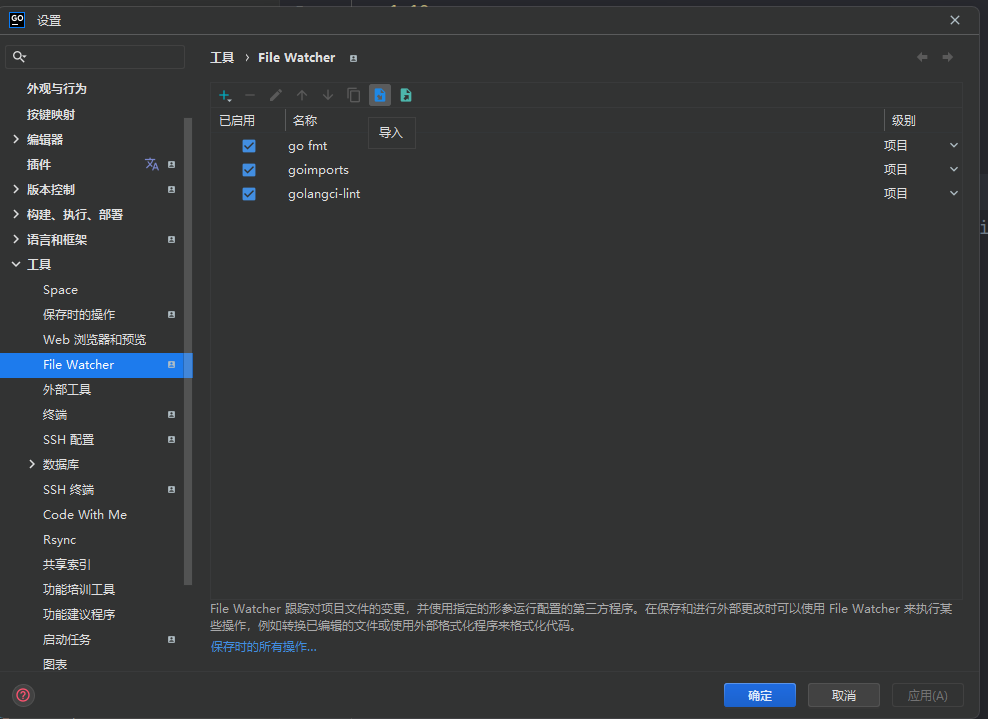
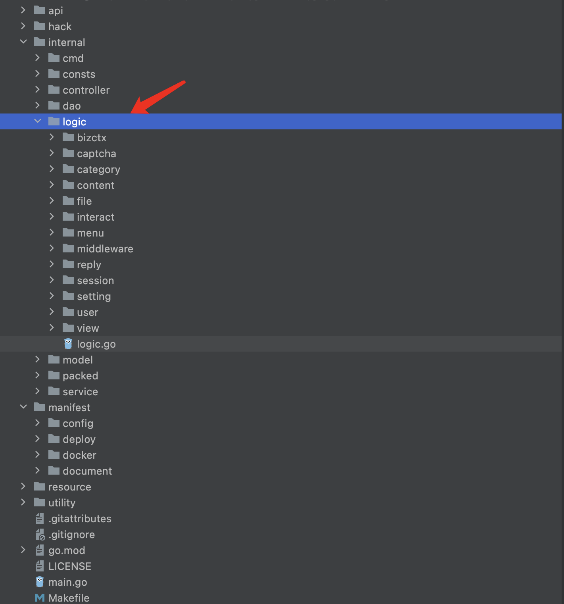
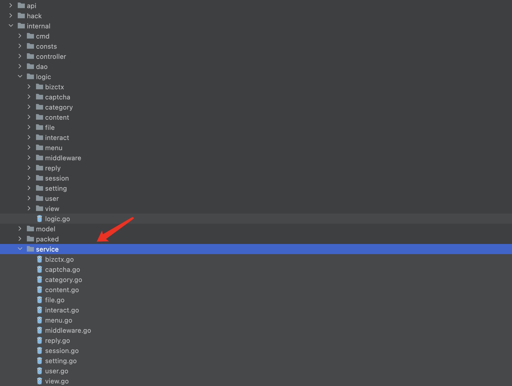
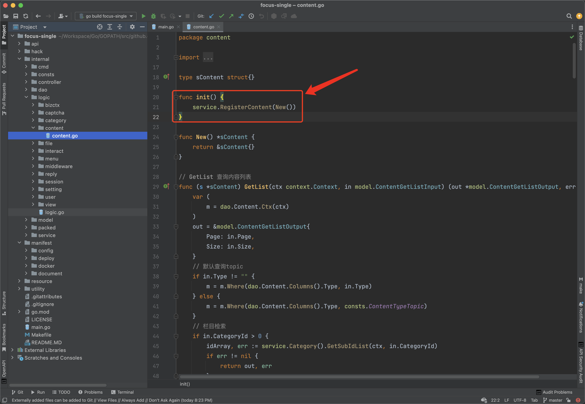
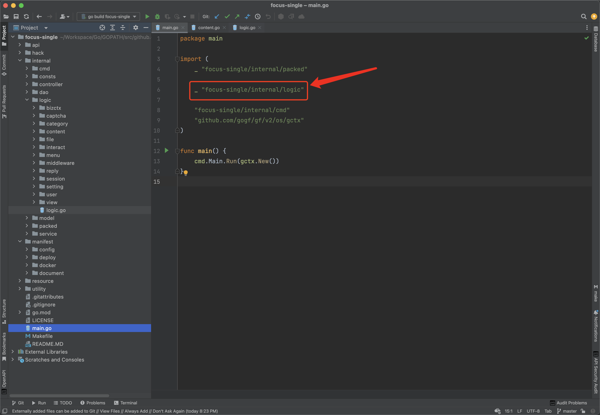
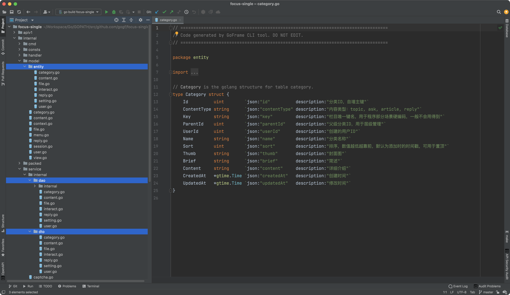
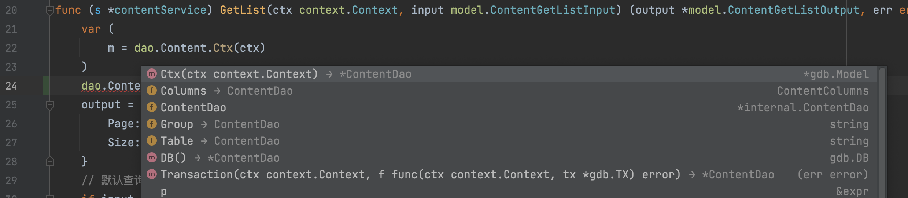
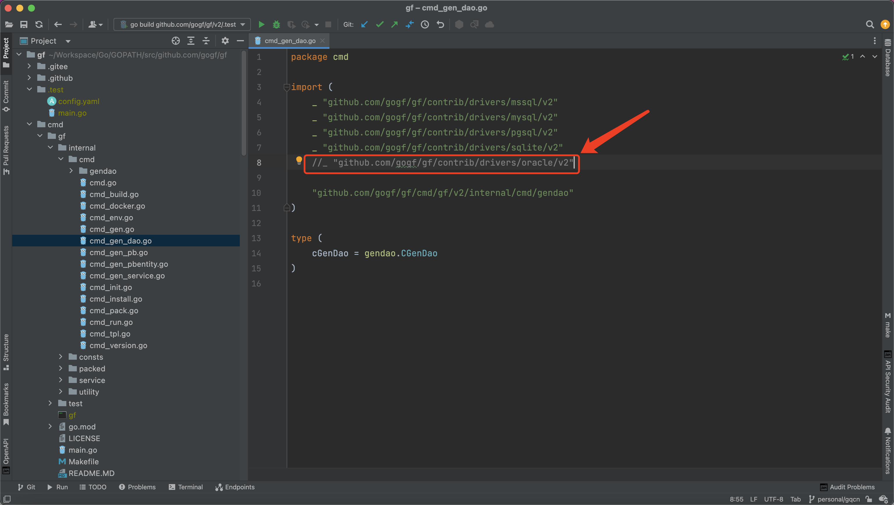
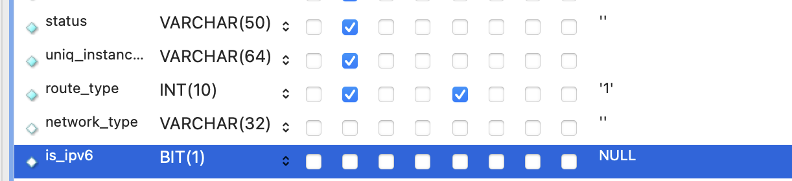
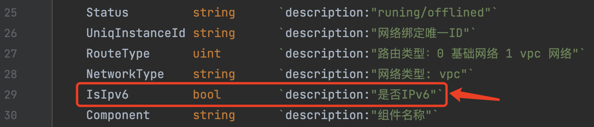

# 开发工具

GoFrame框架提供了功能强大的gf命令行开发辅助工具，是框架发展的一个重要组成部分

## 简介

GoFrame框架提供了功能强大的gf命令行开发辅助工具，是框架发展的一个重要组成部分，工具地址：[https://github.com/gogf/gf/tree/master/cmd/gf](https://github.com/gogf/gf/tree/master/cmd/gf)
工具安装请参考仓库页面

### 工具职责

- 简化工程开发，提高开发效率
- 支持框架工程设计规范准确落地

::: tip

- 部分命令需要您先安装好Golang基础的开发环境，环境安装具体请参考 环境安装 章节。
- 最新的CLI工具版本会随着最新的框架版本走
  :::

## 安装

### 预编译安装

- **Mac** or **Linux**

```shell
wget -O gf "https://github.com/gogf/gf/releases/latest/download/gf_$(go env GOOS)_$(go env GOARCH)" && chmod +x gf &&
./gf install -y && rm ./gf
```

- **Windows**

下载对应的二进制文件，双击按照终端指令安装即可。如果双击安装失败，请采用最后万能的手动编译安装方式。

### 手动编译

```shell
git clone https://github.com/gogf/gf && cd gf/cmd/gf && go install
```

### 验证安装成功

```shell
gf -v
```

显示类似于如下的信息为安装成功

```text
GoFrame CLI Tool v2.1.4, https://goframe.org
GoFrame Version: cannot find go.mod
CLI Installed At: /opt/homebrew/bin/gf
CLI Built Detail:
Go Version:  go1.17.13
GF Version:  v2.1.4
Git Commit:  2022-08-26 15:45:41 a0619f7ff0e1d7766884e3062d1b3b0947c87da4
Build Time:  2022-08-26 15:51:38
```

## Help 查看帮助

```shell
gf -h
```

```text
USAGE
    gf COMMAND [OPTION]

COMMAND
    env        show current Golang environment variables
    run        running go codes with hot-compiled-like feature
    gen        automatically generate go files for dao/do/entity/pb/pbentity
    tpl        template parsing and building commands
    init       create and initialize an empty GoFrame project
    pack       packing any file/directory to a resource file, or a go file
    build      cross-building go project for lots of platforms
    docker     build docker image for current GoFrame project
    install    install gf binary to system (might need root/admin permission)
    version    show version information of current binary

OPTION
    -y, --yes       all yes for all command without prompt ask
    -v, --version   show version information of current binary
    -d, --debug     show internal detailed debugging information
    -h, --help      more information about this command

ADDITIONAL
    Use "gf COMMAND -h" for details about a command.
```

> 任何不懂的，就用help看看吧。

## Version 查看版本

``gf -v ``或``gf version``

用以查看当前gf命令行工具编译时的版本信息，包括当前目录下的框架版本信息，框架安装目录，go版本信息等等

```text
GoFrame Version: cannot find go.mod
CLI Installed At: /opt/homebrew/bin/gf
CLI Built Detail:
Go Version:  go1.17.13
GF Version:  v2.1.4
Git Commit:  2022-08-26 15:45:41 a0619f7ff0e1d7766884e3062d1b3b0947c87da4
Build Time:  2022-08-26 15:51:38
```

## Init 创建项目

```shell
gf init <项目目录> [-u] [-m]
```

我们可以使用``init``命令在当前目录生成一个示例的``GoFrame``空框架项目，并可给定项目名称参数。生成的项目目录结构仅供参考，根据业务项目具体情况可自行调整。生成的目录结构请参考
代码分层设计 章节,
-u表示升级,默认是2.0.6，-u升级到最新版，-m使用表示多应用(大仓)的项目
::: warning 注意
GoFrame框架开发推荐统一使用官方的go module特性进行依赖包管理，因此空项目根目录下也有一个go.mod文件。
:::
::: warning 
工程目录采用了通用化的设计，实际项目中可以根据项目需要适当增减模板给定的目录。例如，没有kubernetes部署需求的场景，直接删除对应deploy目录即可。
:::
## Build 交叉编译

```shell
gf build [入口文件] [-n 输出二进制文件名字] [-v 输出二进制文件版本] [-a 系统架构] [-s 欲构建系统] [-o 输出路径] ... 
```

该命令支持配置，配置选项的释义同命令行同名选项。

| 名称                      | 必须  | 默认值         | 含义                                                    | 示例                                                                                                                                                                                                                                                                                                                                                                                                                                                        |
|-------------------------|-----|-------------|-------------------------------------------------------|-----------------------------------------------------------------------------------------------------------------------------------------------------------------------------------------------------------------------------------------------------------------------------------------------------------------------------------------------------------------------------------------------------------------------------------------------------------|
| arch                    | 否   | 当前系统架构      | 编译架构，多个以,号分隔，如果是all表示编译所有支持架构                         | 386,amd64,arm                                                                                                                                                                                                                                                                                                                                                                                                                                             |
| cgo  <sup>`[1]`</sup>   | 否   | 0           | 	是否开启CGO，默认是关闭的。如果开启，那么交叉编译可能会有问题。                    | 0                                                                                                                                                                                                                                                                                                                                                                                                                                                         |
| extra                   | 否   |             | 额外自定义的编译参数，会直接传递给go build命令                           |                                                                                                                                                                                                                                                                                                                                                                                                                                                           |
| mod                     | 否   |             | 同go build -mod编译选项，不常用                                | 	none                                                                                                                                                                                                                                                                                                                                                                                                                                                     |
| name                    | 否   | 与程序入口go文件同名 | 生成的可执行文件名称。如果是windows平台，那么默认会加上.exe后缀                 | gf                                                                                                                                                                                                                                                                                                                                                                                                                                                        |
| output                  | 否   |             | 输出的可执行文件路径，当该参数指定时，name和path参数失效，常用于编译单个可执行文件         | ./bin/gf.exe                                                                                                                                                                                                                                                                                                                                                                                                                                              |
| packSrc<sup>`[2]`</sup> | 否   |             | 需要打包的目录，多个以,号分隔，生成到internal/packed/build_pack_data.go | public,template                                                                                                                                                                                                                                                                                                                                                                                                                                           |
| path                    | 否   | 	./bin      | 	编译可执行文件存储的目录地址                                       | 	./bin                                                                                                                                                                                                                                                                                                                                                                                                                                                    |
| system                  | 否   | 当前系统平台      | 编译平台，多个以,号分隔，如果是all表示编译所有支持平台                         | linux,darwin,windows                                                                                                                                                                                                                                                                                                                                                                                                                                      |
| varMap                  | 否   |             | 自定义的内置变量键值对                                           | gfcli:<br>&emsp;build:<br>&emsp;&emsp;name:     "gf"<br>&emsp;&emsp;&emsp;arch:     "all"<br>&emsp;&emsp;&emsp;system:   "all"<br>&emsp;&emsp;&emsp;mod:      "none"<br>&emsp;&emsp;&emsp;cgo:      0<br>&emsp;&emsp;&emsp;pack:     ""<br>&emsp;&emsp;&emsp;version:  "v1.0.0"<br>&emsp;&emsp;&emsp;output:   "./bin"<br>&emsp;&emsp;&emsp;extra:    ""<br>&emsp;&emsp;&emsp;varMap:<br>&emsp;&emsp;&emsp;&emsp;k1: v1<br>&emsp;&emsp;&emsp;&emsp;k2: v2 |
| version                 | 否   |             | 程序版本，如果指定版本信息，那么程序生成的路径中会多一层以版本名称的目录                  | v1.0.0                                                                                                                                                                                                                                                                                                                                                                                                                                                    |

支持的系统架构

| 系统        | 架构       |
|-----------|----------|
| darwin    | amd64    |
| darwin    | arm64    |
| ios       | amd64    |
| ios       | arm64    |
| freebsd   | 386      |
| freebsd   | amd64    |
| freebsd   | arm      |
| netbsd    | 386      |
| netbsd    | amd64    |
| netbsd    | arm      |
| openbsd   | 386      |
| openbsd   | amd64    |
| openbsd   | arm      |
| windows   | 386      |
| windows   | amd64    |
| android   | arm      |
| dragonfly | amd64    |
| plan9     | 386      |
| plan9     | amd64    |
| solaris   | amd64    |
| linux     | 386      |
| linux     | amd64    |
| linux     | arm      |
| linux     | arm64    |
| linux     | ppc64    |
| linux     | ppc64le  |
| linux     | mips     |
| linux     | mipsle   |
| linux     | mips64   |
| linux     | mips64le |

`[1]`: cgo开启后，可能不支持交叉编译，可以只用``xgo``来进行交叉编译<br>
`[2]`: 1: 打包，多人反应可能有问题，建议手动执行``gf pack`` 命令<br>
&emsp;&emsp;&emsp;2: 官方文档与实际代码不一致
实际代码：

| 名称      | 必须  | 默认值 | 含义       | 示例  |
|---------|-----|-----|----------|-----|
| packSrc | 否   |     | 需要打包的源路径 |     |
| packDst | 否   |     | 打包到哪里    |     |

## Gen 代码生成

### 服务

```shell
gf den service
```

::: tip 注意
先编写逻辑代码，再生成相应的服务接口
:::

| 名称           | 必须  | 默认值              | 含义                                                                         |
|--------------|-----|------------------|----------------------------------------------------------------------------|
| srcFolder    | 是   | internal/logic   | 指向logic代码目录地址                                                              |
| dstFolder    | 是   | internal/service | 指向生成的接口文件存放目录                                                              |
| stPattern    | 是   | s([A-A]\w+)      | 使用正则指定业务模块结构体定义格式，便于解析业务接口定义名称。在默认的正则下，所有小写s开头，大写字母随后的结构体都将被当做业务模块接口名称。例如： |
| watchFile    | 否   |                  | 用在代码文件监听中，代表当前改变的代码文件路径                                                    |
| packages     | 否   |                  | 仅生成指定包名的接口文件，给定字符串数组，通过命令行传参则给定JSON字符串，命令行组件自动转换数据类型                       |
| importPrefix | 否   |                  | 指定生成业务引用文件中的引用包名前缀                                                         |
| overwrite    | 否   | true             | 生成代码文件时是否覆盖已有文件                                                            |

#### 手动模式

如果是手动执行命令行，直接在项目根目录下执行  ``gf gen service`` 即可。

#### 自动模式

如果您是使用的GolandIDE，那么可以使用我们提供的配置文件：[watchers.xml](/files/watchers.xml)  自动监听代码文件修改时自动生成接口文件。使用方式，如下图：


#### 具体使用手摸手

1. 我们建议您在使用Goland IDE时，使用我们提供的配置文件：[watchers.xml](/files/watchers.xml)
2. 编写您的业务逻辑代码<br>
3. 生成接口及服务注册文件<br>如果您已经按照Step1做好了配置，那么这一步可以忽略。因为在您编写代码的时候，``service``
   便同时生成了接口定义文件。<br>否则，每一次在您开发/更新完成``logic``业务模块后，您需要手动执行一下 ``gf gen service``
   命令
4. 注意服务的实现注入部分（仅一次）<br>
   只有在生成完成接口文件后，您才能在每个业务模块中加上接口的具体实现注入。该方法每个业务模块加一次即可。
5. 在启动文件中引用接口实现注册（仅一次）<br> 该文件的引入需要在``main``包的最顶部引入，需要注意``import``
   的顺序，放到最顶部，后面加一个空行。如果同时存在``packed``包的引入，那么放到``packed``
   包后面。像这样：
   可以发现，该命令除了生成接口文件之外，还生成了一个接口实现注册文件。该文件用于在程序启动时，将接口的具体实现在启动时执行注册。
6. Start&Enjoy<br>启动``main.go``即可。

### dao

```shell
gf den dao
```

| 名称             | 必须  | 默认值          | 含义                                                                                                                                                                         | 示例                 |
|----------------|-----|--------------|----------------------------------------------------------------------------------------------------------------------------------------------------------------------------|--------------------|
| gfcli.gen.dao  | 是   |              | ``dao``代码生成配置项，可以有多个配置项构成数组，支持多个数据库生成。不同的数据库可以设置不同的生成规则，例如可以生成到不同的位置或者文件。                                                                                                  | -                  |
| link           | 是   |              | 分为两部分，第一部分表示你连接的数据库类型mysql, postgresql等, 第二部分就是连接数据库的dsn信息。具体请参考 ORM使用配置 章节。                                                                                               | -                  |
| path           | 否   | internal     | 生成``dao``和``model``文件的存储目录地址。                                                                                                                                              | ./app              |
| group          | 否   | default      | 在数据库配置中的数据库分组名称。只能配置一个名称。数据库在配置文件中的分组名称往往确定之后便不再修改。                                                                                                                        | default,order,user |
| prefix         | 否   |              | 生成数据库对象及文件的前缀，以便区分不同数据库或者不同数据库中的相同表名，防止数据表同名覆盖。                                                                                                                            | order_,user_       |
| removePrefix   | 否   |              | 删除数据表的指定前缀名称。多个前缀以``,``号分隔。                                                                                                                                                | gf_                |
| tables         | 否   |              | 指定当前数据库中需要执行代码生成的数据表。如果为空，表示数据库的所有表都会生成。                                                                                                                                   | user, user_detail  |
| tablesEx       | 否   |              | ``Tables Excluding``，指定当前数据库中需要排除代码生成的数据表。                                                                                                                                 | product, order     |
| jsonCase       | 否   | CamelLower   | 指定``model``中生成的数据实体对象中``json``标签名称规则，参数不区分大小写。参数可选为：``Camel``、``CamelLower``、``Snake``、``SnakeScreaming``、``SnakeFirstUpper``、``Kebab``、``KebabScreaming``。具体介绍请参考命名行帮助示例。 | Snake              |
| stdTime        | 否   | false        | 当数据表字段类型为时间类型时，代码生成的属性类型使用标准库的``time.Time``而不是框架的``*gtime.Time``类型。                                                                                                        | true               |
| gJsonSupport   | 否   | false        | 当数据表字段类型为``JSON``类型时，代码生成的属性类型使用``*gjson.Json``类型。                                                                                                                         | true               |
| overwriteDao   | 否   | false        | 	每次生成``dao``代码时是否重新生成覆盖``dao/internal``目录外层的文件。注意``dao/internal``目录外层的文件可能由开发者自定义扩展了功能，覆盖可能会产生风险。                                                                          | true               |
| importPrefix   | 否   | 通过go.mod自动检测 | 用于指定生成``Go``文件的``import``路径前缀。特别是针对于不是在项目根目录下使用``gen dao``命令，或者想要将代码文件生成到自定义的其他目录，这个时候配置该参数十分必要。                                                                           | github.com/gogf/gf |
| descriptionTag | 否   | false        | 用于指定是否为数据模型结构体属性增加``desription``的标签，内容为对应的数据表字段注释。                                                                                                                         | true               |
| noModelComment | 否   | false        | 用于指定是否关闭数据模型结构体属性的注释自动生成，内容为数据表对应字段的注释。                                                                                                                                    | true               |

#### jsoncase 选项示例

| Case            | Example            |
|-----------------|--------------------|
| Camel           | AnyKindOfString    |
| CamelLower(默认)  | anyKindOfString    | 
| Snake           | any_kind_of_string |
| SnakeScreaming  | ANY_KIND_OF_STRING |
| SnakeFirstUpper | rgb_code_md5       |
| Kebab           | any-kind-of-string |
| KebabScreaming  | ANY-KIND-OF-STRING |


#### 使用示例
仓库地址：[https://github.com/gogf/focus-single](https://github.com/gogf/focus-single)



1、以下3个目录的文件由dao命令生成：

| 路径                     | 说明      | 详细介绍                                                                             |
|------------------------|---------|----------------------------------------------------------------------------------|
| /internal/dao          | 数据操作对象  | 通过对象方式访问底层数据源，底层基于ORM组件实现。往往需要结合``entity``和``do``通用使用。该目录下的文件开发者可扩展修改，但是往往没这种必要。 |
| /internal/model/do     | 	数据转换模型 | 数据转换模型用于业务模型到数据模型的转换，由工具维护，用户不能修改。<br/>工具每次生成代码文件将会覆盖该目录。                        |
| /internal/model/entity | 	数据模型   | 数据模型由工具维护，用户不能修改。工具每次生成代码文件将会覆盖该目录。                                              |


2、model中的模型分为两类：**数据模型**和**业务模型**。

**数据模型**：通过CLI工具自动生成 model/entity 目录文件，数据库的数据表都会生成到该目录下，这个目录下的文件对应的模型为数据模型。数据模型即与数据表一一对应的数据结构，开发者往往不需要去修改并且也不应该去修改，数据模型只有在数据表结构变更时通过CLI工具自动更新。数据模型由CLI工具生成及统一维护。

**业务模型**：业务模型即是与业务相关的数据结构，按需定义，例如service的输入输出数据结构定义、内部的一些数据结构定义等。业务模型由开发者根据业务需要自行定义维护，定义到model目录下。

3、dao中的文件按照数据表名称进行命名，一个数据表一个文件及其一个对应的DAO对象。操作数据表即是通过DAO对象以及相关操作方法实现。dao操作采用规范化设计，必须传递ctx参数，并在生成的代码中必须通过Ctx或者Transaction方法创建对象来链式操作数据表。



#### 注意事项
###### 需要手动编译的数据库类型
``gen dao``命令涉及到数据访问相关代码生成时，默认支持常用的若干类型数据库。如果需要``Oracle``数据库类型支持，需要开发者自己修改源码文件后自行本地手动编译生成``CLI``工具随后安装，因为这两个数据库的驱动需要``CGO``支持，无法预编译生成给大家直接使用。



###### 关于``bool``类型对应的数据表字段
由于大部分数据库类型都没有``bool``类型的数据表字段类型，我们推荐使用``bit(1)``来代替``bool``类型。``gen dao``命令会自动识别``bit(1)``数据表字段并生成``bool``类型的属性。此外，我们不推荐使用``tinyint(1)``作为``bool``类型。

例如，表字段：



生成的属性：



## Run 自动编译

```shell
gf run <入口文件> [-p 输出目录] [-e 编译参数] [-a 运行参数]
```

### 注意事项

> 由于Go是不支持热编译特性的，每一次代码变更后都要重新手动停止、编译、运行代码文件。run命令也不是实现热编译功能，而是提供了自动编译功能，当开发者修改了项目中的go文件时，该命令将会自动编译当前程序，并停止原有程序，运行新版的程序。

> run命令会递归监控当前运行目录的所有go文件变化来实现自动编译。

-p 表示输出路径，默认是当前目录<br>
-e 表示编译选型<br>
-a 表示运行所需要的参数

## Pack 资源打包

```shell
gf pack <欲打包的文件或目录> <打包后的结果>  [-n] [-p]
```

-n：输出的文件名如果没有提供则默认使用目录名<br>
-p：装入资源文件中的每个文件添加前缀

## Docker 镜像编译

```shell
gf docker <入口文件> [-f dockerfile的文件路径] [-s 在docker build 执行之前需要被执行的shell文件] [-b 在docker映像构建之前] [-tn docker镜像标签内容 ][tp docker镜像的tag前缀]  [-p ] [-e docker构建的参数 ]
``` 

该命令支持配置<br>

| 名称          | 必须  | 默认值                        | 含义                            | 示例  |
|-------------|-----|----------------------------|-------------------------------|-----|
| file        | 否   | manifest/docker/Dockerfile | dockerfile 文件所在路径             |     |
| shell       | 否   | manifest/docker/docker.sh  | docker build之前需要被执行的shell文件路径 |     |
| build       | 否   | -a amd64 -s linux          | 二进制配置信息                       |     |
| tagName     | 否   |                            | 构建镜像的tag前缀                    |     |
| tagPrefixes | 否   |                            | 构建镜像的tag名称                    |     |
| push        | 否   |                            | 自动推送到 docker registry         |     |
| extra       | 否   |                            | docker image的扩展参数             |     |

```text
USAGE
    gf docker [MAIN] [OPTION]

ARGUMENT
    MAIN    main file path for "gf build", it's "main.go" in default. empty string for no binary build

OPTION
    -f, --file           file path of the Dockerfile. it's "manifest/docker/Dockerfile" in default
    -s, --shell          path of the shell file which is executed before docker build
    -b, --build          binary build options before docker image build, it's "-a amd64 -s linux" in default
    -tn, --tagName       tag name for this docker, pattern like "image:tag". this option is required with TagPrefixes
    -tp, --tagPrefixes   tag prefixes for this docker, which are used for docker push. this option is required with
                         TagName
    -p, --push           auto push the docker image to docker registry if "-t" option passed
    -e, --extra          extra build options passed to "docker image"
    -h, --help           more information about this command

EXAMPLE
    gf docker
    gf docker -t hub.docker.com/john/image:tag
    gf docker -p -t hub.docker.com/john/image:tag
    gf docker main.go
    gf docker main.go -t hub.docker.com/john/image:tag
    gf docker main.go -t hub.docker.com/john/image:tag
    gf docker main.go -p -t hub.docker.com/john/image:tag

DESCRIPTION
    The "docker" command builds the GF project to a docker images.
    It runs "gf build" firstly to compile the project to binary file.
    It then runs "docker build" command automatically to generate the docker image.
    You should have docker installed, and there must be a Dockerfile in the root of the project.
```

