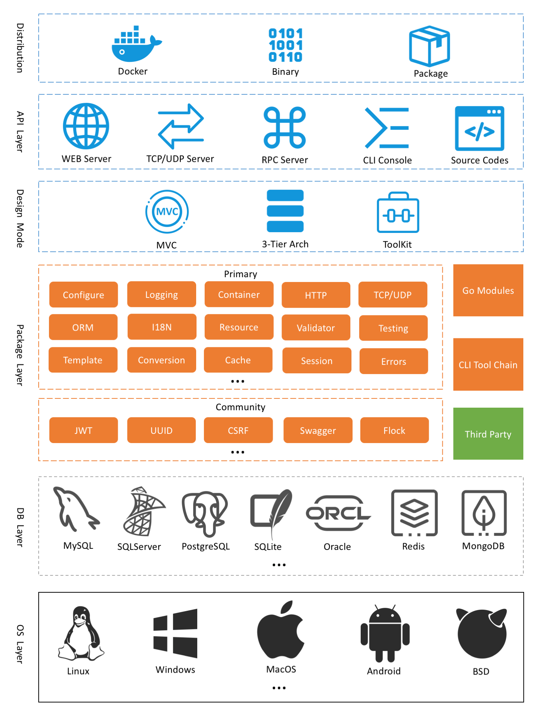

# 项目介绍

## 介绍

`GoFrame`是一款模块化、高性能、企业级的 `Go`基础开发框架。`GoFrame`是一款通用性的基础开发框架，是 `Golang`标准库的一个增强扩展级，包含通用核心的基础开发组件，优点是实战化、模块化、文档全面、模块丰富、易用性高、通用性强、面向团队。如果您想使用 `Golang`开发一个业务型项目，无论是小型还是中大型项目，`GoFrame`是您的不二之选。如果您想开发一个 `Golang`组件库，`GoFrame`提供开箱即用、丰富强大的基础组件库也能助您的工作事半功倍。如果您是团队 `Leader`，`GoFrame`丰富的资料文档、详尽的代码注释、活跃的社区成员将会极大降低您的指导成本，支持团队快速接入、语言转型与能力提升。

## 特点

* 业内领先、工程完备
* 模块化、松耦合设计
* 组件丰富、开箱即用
* 简洁易用、文档详尽
* 接口化、高扩展性设计
* 全链路跟踪特性
* 全错误堆栈特性
* 接口化的错误码支持
* 稳健的工程设计规范
* 更便捷强大的ORM组件
* 便捷的开发工具、自动化代码生成
* 支持 `OpenTelemetry`可观测性标准
* 自动化的接口文档生成，支持 `OpenAPIV3`标准
* 完善的本地中文化支持
* 设计为团队及企业使用

## 架构

## 地址

* **主库** ：[https://github.com/gogf/gf](https://github.com/gogf/gf)
* **码云** ：[https://gitee.com/johng/gf](https://gitee.com/johng/gf)
